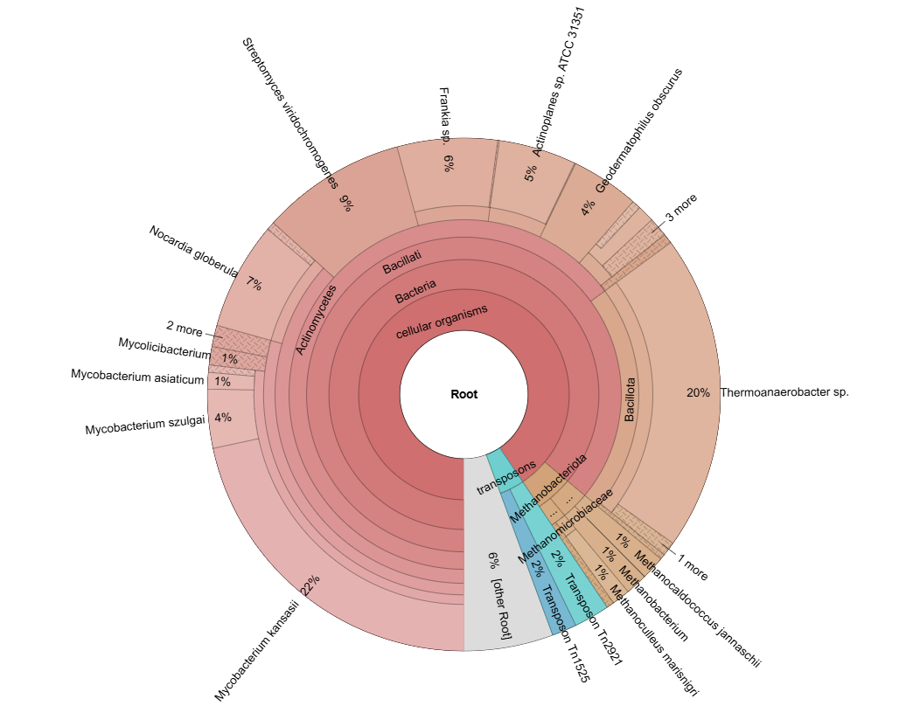
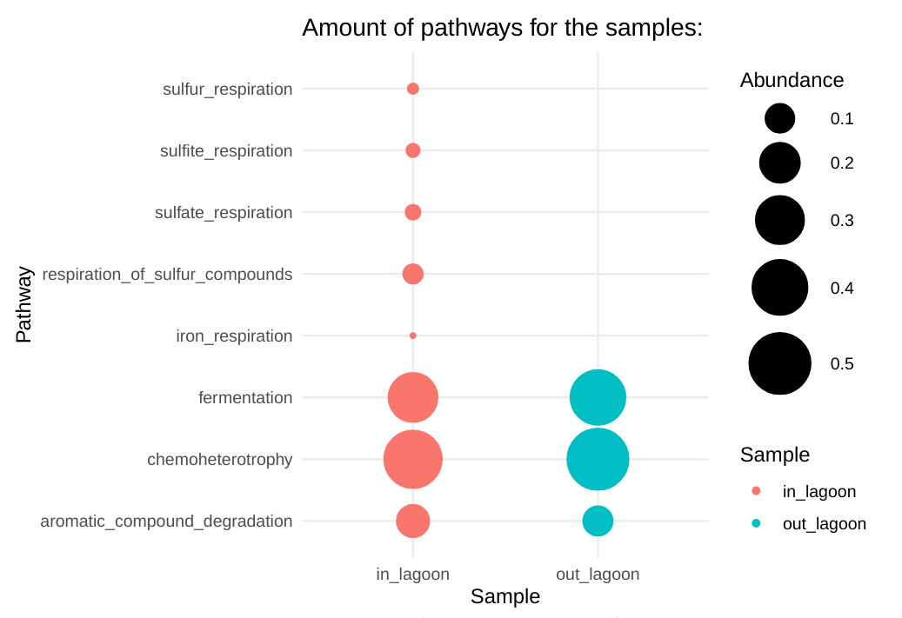

# Metagenomics Pipeline ACFC

## Authors: 
- Jarno Duiker ([https://github.com/azzipxonraj](https://github.com/azzipxonraj))
- Floris Menninga ([https://github.com/Fl-ris](https://github.com/Fl-ris))
- Yamila Timmer ([https://github.com/YamilaTimmer](https://github.com/YamilaTimmer))

## Description

This repository contains a metagenomics pipeline for analyzing 16S data in .FASTQ format. We have constructed this pipeline in order to get insights into the contents of different steps in the water purification process of a Kenyan factory that produces alcohol from sugar molasses, owned by [ACFC](https://acfc.co.ke/). But this pipeline can be used for any 16S .FASTQ formatted data. The pipeline is constructed using SnakeMake and can be found [here](https://github.com/YamilaTimmer/metagenomics-ACFC/blob/main/analysis/Snakefile).


### Pipeline features

1. Quality control/trimming using fastplong
2. Producing a taxonomic classification report using Kraken2, which will show the Operational Taxonomic Units (OTUs) that are present in the sample(s)
3. Improving OTU assignment by using Bracken (optional)
4. Visualising classification output with a Krona piechart
5. Calculating alpha/beta diversity

## System requirements and installation

### System requirements

- OS: Linux
- Python: 3.8 or higher

Hardware requirements, such as processing power or memory depend on the size of the input files. 

### Clone the repository

If using SSH, clone the repository using:

```bash
git clone git@github.com:YamilaTimmer/metagenomics-ACFC.git
```

If using HTTPS, clone the repository using:

```bash
git clone https://github.com/YamilaTimmer/metagenomics-ACFC.git
```

### Creating a conda environment
Create conda environment:

```bash
conda install -c conda-forge -c bioconda snakemake --name {env_name}
```

Activate the environment with

```bash
conda activate {env_name}
```

### Downloading/installing tools
Most of the tools used, utilize the environments in the [envs folder](https://github.com/YamilaTimmer/metagenomics-ACFC/tree/main/envs), conda will recognize these and install the tools into the conda environment, meaning you will not have to do anything to install these tools.

However there is one tool that does require seperate downloading, as it is not accessible through bioconda. First create a `tools` dir to put this tool into:

```bash
mkdir tools
```

#### FAPROTAX

Navigate to the tools directory:

```bash
cd tools
```

And download FAPROTAX V.1.2.10 using:

```bash
wget https://pages.uoregon.edu/slouca/LoucaLab/archive/FAPROTAX/SECTION_Download/MODULE_Downloads/CLASS_Latest%20release/UNIT_FAPROTAX_1.2.10/FAPROTAX_1.2.10.zip
```
Unzip the file:

```bash
unzip FAPROTAX_1.2.10.zip
```

Now there should be a folder called `FAPROTAX_1.2.10.zip`, containing:
- collapse_table.py, which is the python script that links any given OTUs (in kraken report format) to corresponding (metabolic) pathways
- FAPROTAX.txt, which contains the database of all (metabolic) pathways
- README.txt, contains some extra info on the tool

You are now done downloading all necessary files for FAPROTAX, make sure to **not** change any of the file names

### Running the pipeline
In order to run the pipeline, you have to run the snakefile. This can be done using:

```bash
snakemake --use-conda
```

You have to pass the flag `--use-conda`, so that conda knows that it has to use/build the environments in the env dir.


#### Using with slurm

```bash
 pip install snakemake-executor-plugin-slurm
```
```bash
snakemake --use-conda --profile slurm/
```


### Version details
The pipeline is made using SnakeMake version `8.27.1` and python version `3.12.8`. The following tools have been used for the pipeline:

| Tool/library Name        | Description                                                 | Version   |
|---------------------|-------------------------------------------------------------|-----------|
| [fastplong](https://github.com/OpenGene/fastplong)|Quality control and trimming of data|0.2.2|
| [Kraken2](https://github.com/DerrickWood/kraken2)|Taxonomic classification of 16S data |2.1.3|
| [Bracken](https://github.com/jenniferlu717/Bracken)|Re-estimating abundances from Kraken2 output|3.0|
| [Krona](https://github.com/marbl/Krona)|Visualising taxonomic classification in a sample|2.8.1|
| [kraken-biom](https://github.com/smdabdoub/kraken-biom)|Converting kraken file to json formatted .biom|1.2.0|
| [FAPROTAX](http://www.loucalab.com/archive/FAPROTAX/lib/php/index.php?section=Home) |Functional analysis for finding (metabolic) pathways that match the founc OTUs|1.2.10|
| [krakentools](https://github.com/jenniferlu717/KrakenTools)|Used Python script for beta-diversity|n.a.|
| [Pavian](https://github.com/fbreitwieser/pavian)|Interactive dashboard for visualizing kraken report (e.g. Sankey chart)|1.0|

# Background info
This pipeline is built around the concept of metagenomics, which is the study of microorganisms in an environment. Environments can range from the human gut to wastewater, so there are plenty of different applications. In order to create an overview of the different types of microorganisms that live in an environment, genetic material needs to be sequenced and further analyzed. In our case, this is 16S rRNA data. Classification software such as Kraken2 identifies reads within the .FASTQ files and assigns them to an OTU, which could be any level of taxonomy (from "broad" to "specific": domain, kingdom, phylum, class, order, family, genus, species). After classification, the results can be visualized using tools such as Krona, these visualizations are pretty simple to interpret as they consist merely of a multi-layer piechart and also Sankey charts are very intuitive. 

One step further, after classification, is looking at what kind of metabolic processes are taking place in the environment. This can be estimated using the "abundance" of an OTU, or how much of the OTU is present in the sample. To figure out what OTUs belong to what kind of processes, they will have to be mapped against a pathway database. This can be done using FAPROTAX, where, each OTU will be checked if they are known for contributing to any of the pathways. The output of the functional analysis consists of .biom files per pathway, showing what OTUs are linked to it, and a larger overview file where the abundance is noted per pathway, the higher the number, the more likely it is that this pathway has a large influence on the environment. However, functional analysis is merely an estimate of the activity of the pathways. To confirm these estimates, metatranscriptomics will have to be performed.


## Examples of visualisations
### Krona Piechart
Below you can see an example of a Krona piechart that gets generated using this pipeline. The piechart shows an overview of the different classifications found by Kraken2, based on the input .FASTQ reads.




### R plots
Below you can see an example of a visualization of the different (metabolic) pathways across samples. It shows what processes take place in what samples, and with what abundance the processes take place. The more classified species that perform a certain metabolic pathway, the higher the abundance (and the larger the bubble).



## Support
In case of any bugs or needed support, open an issue [here](https://github.com/YamilaTimmer/depmap-portal-data-visualizations/issues).

## License
This project is licensed under the GPL-3.0 license. See the [LICENSE file](https://github.com/YamilaTimmer/metagenomics-ACFC/blob/main/LICENSE) for details.

