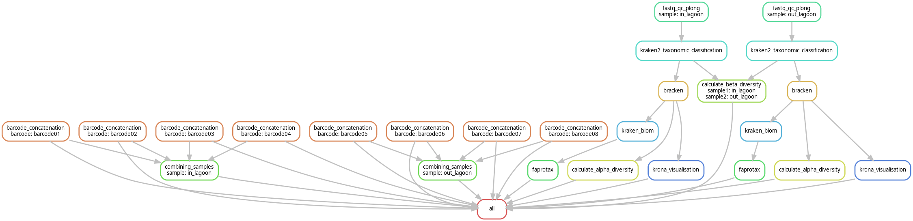
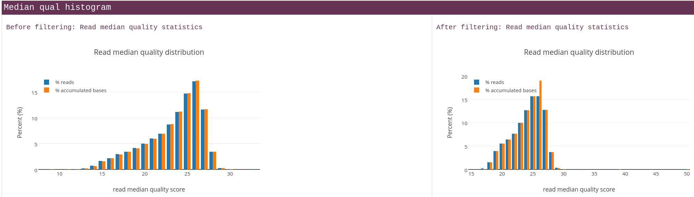
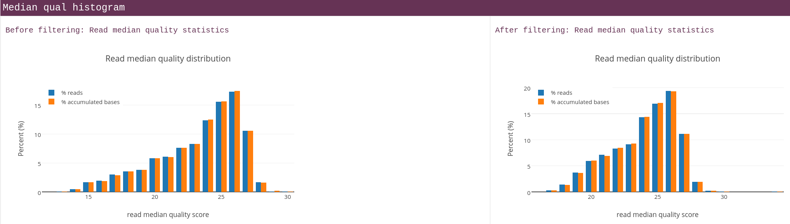
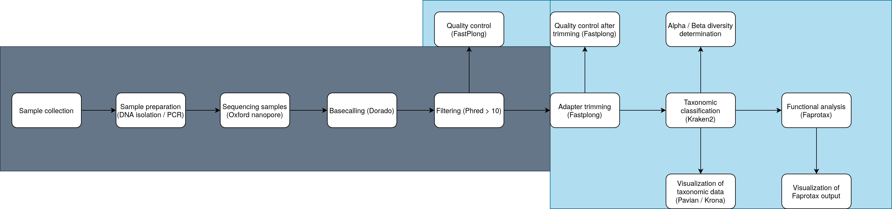
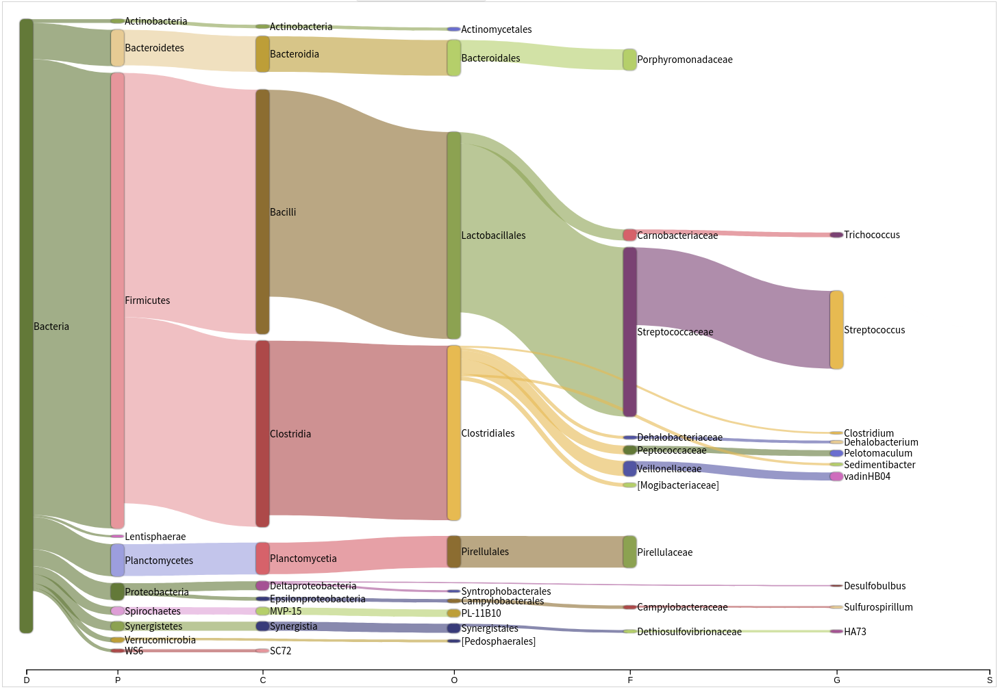
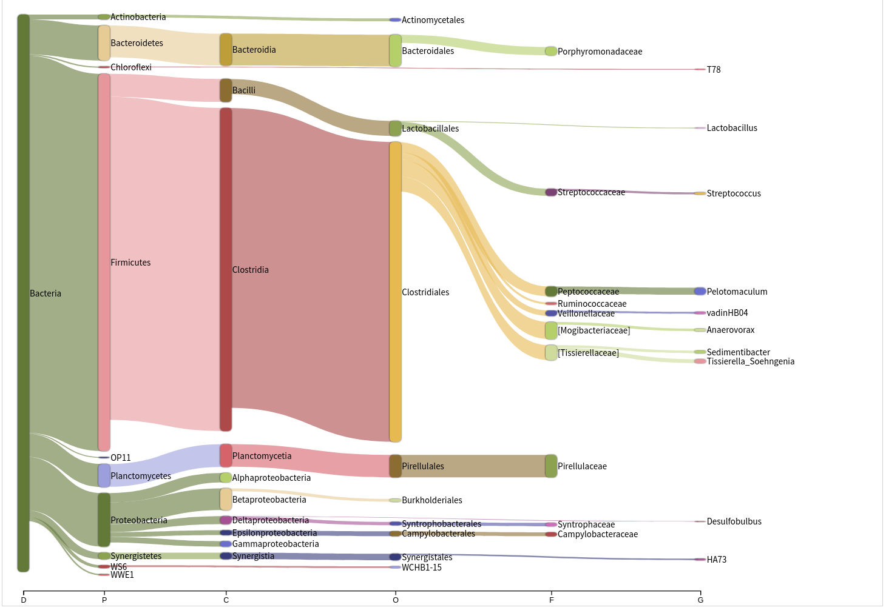
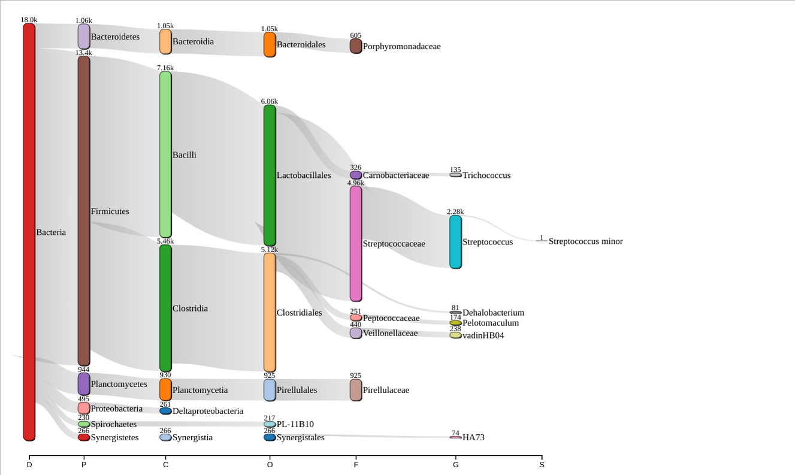

\
\


```{r setup, include=FALSE}
knitr::opts_chunk$set(echo = TRUE)
```


15-03-2025:

# **Introduction** #

The wastewater of a Kenyan water treatment plant contains many organisms whose presence influences the water quality by their production of toxins like those produced by algal blooms from Cyanobacteria. (@hart2025metagenomics) These algal blooms are a global threat to freshwater systems like the Nyando River. 
Using more traditional chemical analyses, an abundance of nitrogen, phosphorus and potassium was determined.

It is imperative to measure toxins or in this case genetic material from the micro-organisms that produce them. This wastewater is directly exhausted into the Nyando River, a basin covering about 3,590 square kilometers. Life expectancy in the region is very low, averaging 37.7 years for males and 42.9 years for females. Enhancing water quality could contribute to a higher crop yield and better health for other organisms that make use of these wetlands.

This water provides food, stores energy and is crucial for biodiversity. (@obiero2012people) These resources are threatened by wastewater from factories and treatment plants like ACFC, a Kenyan factory that produces industrial spirits and yeast from sugar molasses.

In this wastewater treatment facility is among other process steps a digester, with a lagoon where the wastewater is expelled into. The effect of this digester on the microbial diversity and number will be determined.

There are a total of three samples, the first one was taken before the water enters the digester, the second inside of the digester and the last one in the lagoon before entering the Nyando River. 
We will make a comparison between these samples and we will determine if the amount of bacteria or other microorganisms exceeds the limits for reclaimed water before and after entering the digester. The scope of this article is limited to determining the influence of the digester in the wastewater treatment facility. So even if there already are contaminants, as long as their numbers are not increasing, the treatment process is not at fault.

Metagenomics is DNA based and can provide information about what organisms are present in the sample, this can be taxonomic and phylogenetic information. (@hong2020metagenomics)

To do this, a bio-informatics pipeline was constructed to compare these samples in which a taxonomic classification will be applied on the samples using the Kraken2 tool to check the presence of known algal bloom causing Cyanobacteria. (@hart2025metagenomics) Given the results from incubating the samples on agar plates, we hypothesize that there are toxin producing Cyanobacteria in the samples but that the digester doesn’t make a difference for the diversity and number of those organisms. 

In addition to the phylogenetic classification, there will also be an antibiotic resistance test to determine what antibiotic resistance genes the micro-organisms have if they are present as part of the functional analysis. This will provide an overview of means to combat the bacteria found in the sample more effectively. (@LALGUPTA2020105667)

To first assemble the microbial genomes from the metagenomic dataset, several tools can be used like Kraken2, Concoct and Kaiju.
Identifying potentially up to 2000 micro-organisms in the sample can be challenging given that their average genome size would be 4 Mpb 8 Gpb of reads would have to be obtained to get an average coverage of 1x (al2015removal). A functional analysis can be done by comparing the microorganisms found using Kraken2 against a database like Faprotax (@terlouw2023mibig) This database has for every species/genus the pathways that are know to occur in them.  

---

\

```{r libraries, results='hold', message=FALSE, warning=FALSE}

library(tidyverse)
library(ggplot2)
library(webshot)

```

The diversity of the microbiome will be quantified using the alpha diversity measure (Shannon's index). This is a formula that can be applied to calculate this measure for diversity. (@knight2018best)

# **Pipeline** #
The different steps of the pipeline are explained below.

Overview:
1. Quality control with Fastplong
2. Trimming of adapter sequences with Fastplong
3. Taxonomic classification with Kraken2
4. Visualization of Kraken2 results using Kurona / Pavian 
5. Functional analysis of the micro-organisms found

## **Snakemake** ##
To execute this pipeline Snakemake is used. \
Snakemake is a workflow management system created to be reproducible and scalable. \
Workflows are described via a human readable Python based language. Snakemake can also entail a description of required software, which can be automatically  be deployed to the execution environment. 


Unit tests where generated for all the snakemake rules: "snakemake --generate-unit-tests" \
Slurm was used to distribute the tasks over the cluster. (assemblix and assemblix2025) \
The workflow was visualized using a DAG graph: \


## **Library / Tool versions:** ##


| Tool | Version | Description |
|------|---------|-------------|
| R | 4.4.1 | Statistical computing and graphics environment |
| Fastplong | 0.2.2 | Tool for long-read sequence analysis |
| Kraken | 2.1.2 | Taxonomic sequence classification system |
| Bracken | 3.0.1 | Bayesian re-estimation of abundance after classification with Kraken |
| Krona | 2.8.1 | Interactive metagenomic visualization tool |
| Pavian | 1.0 | Interactive browser application for analyzing metagenomics data |
| kraken-biom | 1.2.0 | Creates BIOM-format tables from Kraken output |
| FAPROTAX | 1.2.10 | Functional annotation of prokaryotic taxa |


##  **Sample preparation** ##

Samples: 
A nanopore with a FLO-MIN106 flowcell, pore version: R9.4.1 was used for sequencing. 
Basecalling was done with Dorado and the samples were filtered for a phred score of > 10 before we received the data. 


| # | Condition |
|---|------------|
| 1 | In lag, + glyc, - schud |
| 2 | In lag, + glyc, + schud |
| 3 | In lag, - glyc, - schud |
| 4 | In lag, - glyc, + schud |
| 5 | Out lag, + glyc, -schud |
| 6 | Out lag, + glyc, + schud |
| 7 | Out lag, - glyc, - schud |
| 8 | Out lag, - glyc, + schud |
| 9 | Dig, + glyc, + schud |
| 10 | Dig, + gly, + schud |
| 11 | Dig, -gly, -schud |
| 12 | Dig, - gly, +schud |

The three groups: In the lagoon, Outside of the lagoon and in the digester. 
The "In lagoon" sample can also be called influent and the "Out lagoon" sample can be called effluent. 
Some samples have been treated with glycerol in order to better preserve the sample in the -80 freezer but the glycerol and non glycerol samples have been combined. 


As per usual with Nanopore results, the samples were distributed over many seperate .fastq files. These were combined using the following bash script:

First, to combine all fastq files for every barcode.
```{bash eval = F}
cat barcode01/*.fastq.gz > /students/2024-2025/Thema07/metagenomics/wastewater/data/barcode01.fastq
cat barcode02/*.fastq.gz > /students/2024-2025/Thema07/metagenomics/wastewater/data/barcode02.fastq
cat barcode03/*.fastq.gz > /students/2024-2025/Thema07/metagenomics/wastewater/data/barcode03.fastq
cat barcode04/*.fastq.gz > /students/2024-2025/Thema07/metagenomics/wastewater/data/barcode04.fastq
cat barcode05/*.fastq.gz > /students/2024-2025/Thema07/metagenomics/wastewater/data/barcode05.fastq
cat barcode06/*.fastq.gz > /students/2024-2025/Thema07/metagenomics/wastewater/data/barcode06.fastq
cat barcode07/*.fastq.gz > /students/2024-2025/Thema07/metagenomics/wastewater/data/barcode07.fastq
cat barcode08/*.fastq.gz > /students/2024-2025/Thema07/metagenomics/wastewater/data/barcode08.fastq
cat barcode09/*.fastq.gz > /students/2024-2025/Thema07/metagenomics/wastewater/data/barcode09.fastq
cat barcode10/*.fastq.gz > /students/2024-2025/Thema07/metagenomics/wastewater/data/barcode10.fastq
cat barcode11/*.fastq.gz > /students/2024-2025/Thema07/metagenomics/wastewater/data/barcode11.fastq
```
Combining multiple barcodes into three samples according to the group they are in (In lagoon, out lagoon and digester)


```{bash eval = F}
# Combining all barcodes for the "In lagoon" sample:
cat barcode01.fastq barcode02.fastq barcode03.fastq barcode04.fastq  > /students/2024-2025/Thema07/metagenomics/wastewater/data/in_lagoon.fastq

# The same was done for the "Out lagoon" sample:
cat barcode05.fastq barcode06.fastq barcode07.fastq barcode08.fastq  > /students/2024-2025/Thema07/metagenomics/wastewater/data/out_lagoon.fastq

# And the "Digester" sample:
cat barcode09.fastq barcode10.fastq barcode11.fastq barcode12.fastq  > /students/2024-2025/Thema07/metagenomics/wastewater/data/digester.fastq
```

Later, I consolidated these bash commands into two snakemake rules:

```{r, eval=F}

rule barcode_concatenation:
    input:
        lambda wildcards: glob.glob(config["BARCODE_DIRECTORIES"][wildcards.barcode] + "/*")
    output:
        f"{OUT_DIR}/fastq/{{barcode}}.fastq.gz"
    log:
        f"{LOG_DIR}/cat/{{barcode}}.log"
    shell:
        """
        cat {input} > {output} 2> {log}
        """

rule combining_samples:
    input:
        lambda wildcards: expand(f"{OUT_DIR}/fastq/{{barcode}}.fastq.gz", barcode=config["sample_barcodes"][wildcards.sample])
    output:
        f"{OUT_DIR}/combined_fastq/{{sample}}.fastq"
    log:
        f"{LOG_DIR}/combining_samples/{{sample}}.log"
    shell:
        """
        cat {input} > {output} 2> {log}
        """

```

The first rule concatenates all the fastq files in the barcode directories into one file for every barcode.
According to the sample table, all samples taken in the same place where put together ignoring the use of glycerol that was used for some of the samples. It should have 
no effect on the genetic material in the samples. The "glob.glob" python function is used to match the path for all directories without needing to specify them all manually. 

The relevant part of the config.yaml file:

```{r, eval=F}
samples:
    #digester: /students/2024-2025/Thema07/metagenomics/wastewater/data/digester.fastq.gz
    in_lagoon: /students/2024-2025/Thema07/metagenomics/wastewater/data/in_lagoon.fastq.gz
    out_lagoon: /students/2024-2025/Thema07/metagenomics/wastewater/data/out_lagoon.fastq.gz

sample_barcodes:
    in_lagoon: ["barcode01", "barcode02", "barcode03", "barcode04"]
    out_lagoon: ["barcode05", "barcode06", "barcode07", "barcode08"]
    #digester: ["barcode09", "barcode10", "barcode11", "barcode12"]

```
Both the samples and the sample barcodes can easily be changed to allow for the use of different samples and barcode combinations. 
The digester sample is commented out for reasons that will become apparent in the quality control section below. 


## **Quality control** ##
To check the quality of the raw sequence data, Fastplong was used. (@Chen2023) \
At first we planned to use Trimmomatic and FastQC like we had done in an earlier analysis but they are made to work with Illumina data while we are working with Nanopore data. 
Fastplong functionally combines Trimmomatic and FastQC with its adapter trimming and reports with the quality distribution of the reads, both before and after filtering.
Fastplong returns both a .html report and a trimmed fastq file. 

### **Results** ###

The sample taken from the digester only contained 2 reads before filtering with Fastplong and 1 after. 
We decided that it was unusable and all downstream analyses where done without it.
The table below shows this in the "Total Reads" row. 


| Statistic         | Before Filtering        | After Filtering         |
|-----------------|-------------------------|-------------------------|
| Total Reads       | 2                       | 1                       |
| Total Bases       | 1.873000 K             | 507                     |
| Minimum Length    | 507                     | 507                     |
| Maximum Length    | 1.366000 K             | 507                     |
| Median Length     | 1.366000 K             | 507                     |
| Mean Length       | 936                     | 507                     |
| N50 Length        | 1.366000 K             | 507                     |
| GC Content        | 54.458089%              | 51.676529%              |
| Q5 Bases          | 1.796000 K (95.888948%) | 490 (96.646943%)       |
| Q7 Bases          | 1.631000 K (87.079552%) | 457 (90.138067%)       |
| Q10 Bases         | 1.358000 K (72.504004%) | 378 (74.556213%)       |
| Q15 Bases         | 1.107000 K (59.103043%) | 309 (60.946746%)       |
| Q20 Bases         | 874 (46.663107%)        | 234 (46.153846%)       |
| Q30 Bases         | 248 (13.240790%)        | 62 (12.228797%)        |
| Q40 Bases         | 0 (0.000000%)           | 0 (0.000000%)           |


The sample taken from inside the lagoon has ~18K reads after filtering. 


| Statistic         | Before Filtering          | After Filtering          |
|-------------------|---------------------------|--------------------------|
| Total Reads       | 20.242000 K               | 18.042000 K              |
| Total Bases       | 28.870993 M               | 23.485654 M              |
| Minimum Length    | 3                         | 17                       |
| Maximum Length    | 13.903000 K               | 13.903000 K              |
| Median Length     | 1.452000 K                | 1.320000 K               |
| Mean Length       | 1.426000 K                | 1.301000 K               |
| N50 Length        | 1.453000 K                | 1.322000 K               | 
| GC Content        | 53.655196%                | 53.160078%               |
| Q5 Bases          | 28.257982 M (97.876724%)  | 23.065575 M (98.211338%) |
| Q7 Bases          | 26.944736 M (93.328054%)  | 22.133635 M (94.243213%) |
| Q10 Bases         | 24.666336 M (85.436396%)  | 20.436812 M (87.018279%) |
| Q15 Bases         | 21.538507 M (74.602585%)  | 18.037896 M (76.803891%) |
| Q20 Bases         | 18.308551 M (63.415037%)  | 15.468003 M (65.861496%) |
| Q30 Bases         | 5.359630 M (18.564065%)   | 4.511358 M (19.208995%)  |
| Q40 Bases         | 12.277000 K (0.042524%)   | 10.494000 K (0.044683%)  |


And the last sample, taken when the water had exited the lagoon. 
There are only 2.16K reads in this sample after filtering, almost a factor of ten less compared to the "in lagoon" sample. 
This could have an significant impact on species diversity because there are simply less reads so less chance for a more diverse microbiome.


| Statistic         | Before Filtering         | After Filtering          |
|-------------------|--------------------------|--------------------------|
| Total Reads       | 2.410000 K               | 2.164000 K               |
| Total Bases       | 3.400336 M               | 2.855180 M               |
| Minimum Length    | 3                        | 17                       |
| Maximum Length    | 2.075000 K               | 2.075000 K               |
| Median Length     | 1.435000 K               | 1.298000 K               |
| Mean Length       | 1.410000 K               | 1.319000 K               |
| N50 Length        | 1.436000 K               | 1.309000 K               |
| GC Content        | 54.223112%               | 53.883748%               |
| Q5 Bases          | 3.327345 M (97.853418%)  | 2.802639 M (98.159801%)  |
| Q7 Bases          | 3.172289 M (93.293398%)  | 2.687310 M (94.120511%)  |
| Q10 Bases         | 2.901834 M (85.339625%)  | 2.477674 M (86.778207%)  |
| Q15 Bases         | 2.530093 M (74.407147%)  | 2.181687 M (76.411540%)  |
| Q20 Bases         | 2.145847 M (63.106911%)  | 1.865486 M (65.336896%)  |
| Q30 Bases         | 592.594000 K (17.427513%)| 519.403000 K (18.191603%)|
| Q40 Bases         | 1.333000 K (0.039202%)   | 1.168000 K (0.040908%)   |


In the tables above, the N50 length is the largest length L such that 50% of all nucleotides are contained in contigs of size at least L. (source: https://www.nature.com/articles/35057062)

Q5, Q7, Q10 etc. bases is the value of the number of bases at each quality level (Phred score). 

These reads are mostly from 16S rRNA, this gene is commonly used as a phylogenetic marker. 




The figure above displays the difference in read quality before and after filtering with Fastplong. 
The amount of reads was reduced but the quality increased. Perhaps the reads with a lower phred score would suffice but I chose to remove them in order to have more statistical power in the downstream analyses like in Kraken2.




The same was done with the sample from the water that had exited the lagoon. The digester sample contained only one read after filtering so displaying this graph would be meaningless.

The rule in snakemake takes all the samples from the config.yaml used for all the rules. 
FastPlong generates both a .html report for the quality control and a fastq file that has been trimmed. (adapter sequences removed and low quality reads removed)
The standard error is redirected to the logs/QC/ directory for every individual sample. 

```{r, eval=F}

rule fastq_qc_plong:
    input:
        lambda wildcards: config["samples"][wildcards.sample]
    output:
        fastq="trimmed/{sample}.fastq",
        html="QC/{sample}_fastplong_QC.html"
    log:
        "logs/QC/{sample}.log"
    shell:
        """
        tools/fastplong \
        -i {input} \
        -o {output.fastq} \
        -h {output.html} \
        2> {log}
        """

```
In this Snakemake rule, Fastplong takes the arguments mentioned above. 


## **Taxonomic classification** ##
To classify all the reads as belonging to a species or less specific taxon, Kraken2 was used. 
Kraken2 is a taxonomic classification system that uses exact k-mer matches to achieve high accurarcy and fast classification speeds. Each k-mer sequence is matched to the lowest common ancestor of all genomes that contain that k-mer. A k-mer is a substring of length k in a biological sequence. 
We use Kraken2 here to determine what microorganisms are present in the smamples. 

```{r, eval=F}
rule kraken2_taxonomic_classification:
    input:
        reads="trimmed/{sample}.fastq"
    output:
        kraken_report="kraken2/reports/{sample}_report.txt",
        output="kraken2/output/{sample}_output.txt"

    log:
        "logs/kraken2/{sample}.log"
    params:
        db="/data/datasets/KRAKEN2_INDEX/16S_Greengenes",  
        confidence="1",               
        threads=64
    conda:
        "envs/kraken2.yaml"              
    shell:
        """
        kraken2 --db {params.db} \
                --threads {params.threads} \
                --confidence {params.confidence} \
                --output {output.output} \
                --report {output.kraken_report} \
                {input.reads} 2> {log}
        """
```
In the snakemake rule above, kraken2 is run with the parameters: database, confidence and threads. 

Confidence is kept at its default value of 1 and 64 threads are used for this operation.
Kraken outputs a report file (.kraken_report) that lists the classified results in a hierarchical order with a read count and percentage at each taxonomic level. 

The database used is Greengenes, version 13.8, this is a database for use with 16S reads. 
The 16S Greengenes database was used for this. @DeSantis2006


### **Tool Comparison** ###
This tools was chosen based on a comparison made in the following article, (@ye_benchmarking_2019)
Kraken2 performed comparable to similar tools like MEGAN-N, Minimap2 and Kaiju. 
The reason we choose this tool over the other ones is that there are more tools that can use Kraken2's output compared to many of the others. A close contender was Humann3 for taxonomic classification and metaphlan4 for functional analysis but since the necessary databases for Kraken2 were already on the system, we setteled on Kraken2 and Faprotax for the functional analysis. 



The workflow diagram displays the analyses that where not done by us in gray and those that where done by us in light blue. 


### **Visualization of Kraken2 results** ###
Pavian was used to generate a Sankey graph based on the report from Kraken2.




\

There are many more different microorganisms found in the "In lagoon" sample compared to the "Out lagoon" sample.



\

Both charts show that most microorganisms are bacteria, specifically *Firmicutes*.
This is a phylum of mostly gram-positive bacteria.


Bracken was used to compute the abundance of species. When using 16S reads, this could not be done on a species level so the genus level was used. The reason for this is that while the 16S rRNA gene is a good phylogenetic marker, it has constraints for use at the species level because it does not vary enough between species to be able to use it to distinguish between them. 

When comparing the output of Kraken2 with Bracken, many taxa where lost after running Bracken, this is why its output was discarded and the raw Kraken data was used for the downstream analyses. 


## **Bracken** ##
Bracken (Bayesian Re-estimation of Abundance with KrakEN) is a statistical method that computes the abundance of species in DNA sequences from a metagenomics sample. Bracken uses taxonomy labels that are assigned by Kraken2 to estimate the number of reads that originated from each species in the sample. Even though Kraken classifies reads to the best matching location in the taxonomic tree, it does not estimate the abundances of species. Bracken uses the Kraken database to derive probabilities that describe how much sequence from each genome is the same to other genomes in the database. This data is combined with with the assignments for the sample to estimate the abundance at the species level or in our case, the genus level. 

The tool did not work when "S" for species was given as argument. After reading about researchers having the same problem and figuring out that species level estimation is not possible with 16S data, we used "G" to let bracken estimate it to the genus level instead.

After using Bracken, it became apparent that many species got filtered out that were there before and since species level estimation is not possible, we decided to omit Bracken from the pipeline. Yamila has a comparison of the bracken/ no bracken outputs in her Notebook.


```{r rule-bracken, eval=F}
rule bracken:
    input:
        kraken_report=rules.kraken2_taxonomic_classification.output.kraken_report,
        kraken_database=f"{config['kraken2_db_dir']}/16S_Greengenes"
    output:
        bracken_report=f"{OUT_DIR}/bracken/reports/{{sample}}.txt",
        bracken_output=f"{OUT_DIR}/bracken/output/{{sample}}.out"
    params:
        read_length=150,
        threshold=10,
        level="G"
    log:
        f"{LOG_DIR}/bracken/{{sample}}.log"
    threads:
        32
    conda:
        workflow.source_path("../envs/bracken.yaml")
    shell:
        """
        bracken \
            -d {input.kraken_database} \
            -i {input.kraken_report} \
            -o {output.bracken_output} \
            -w {output.bracken_report} \
            -r {params.read_length} \
            -t {params.threshold} \
            -l {params.level} \
        2> {log}
        """
```

The Snakemake rule uses bracken with a read length of 150, a phred threshold of 10 and estimation at genus level.
The threshold is the default value of 10. The read length should require some experimentation because the average read length of the samples varies a lot. 
But there was not enough time to do this and almost all reads conform to this length. 


## **Testing deseq2...** ##


At first, I thought that DESeq2 could be insightful to compare the count data but after looking into it more, the statistical method used would not be usable for metagenomics data since the distribution is different than what DESeq2 expects. 

This means that the results would be statistical insignificant and not worth the time investment to adapt our data for use with it. The code below is my fruitless attempt at using Deseq2.

```{r Test deseq2,  eval=F}
colnames <- c("Group")

coldata <- data.frame(c("In_Lagoon", "Out_Lagoon"), c("In_Lagoon","Out_Lagoon"), row.names = 1)
colnames(coldata) <- colnames

coldata$Group <- factor(coldata$Group)

```

```{r deseq2 test, eval=F, warning=F, message=FALSE}

dds <- DESeqDataSetFromMatrix(countData = counts_df,
                              colData = coldata,
                              design= ~ Group)

dds <- DESeq(dds)

resultsNames(dds) 

res <- results(dds, name="In_vs_Out_lagoon")

res <- lfcShrink(dds, coef="In_vs_Out_lagoon", type="apeglm")

summary(res)
```


# **Functional analysis** #
The goal of a functional analysis is to determine what metabolic activity the organism is able to perform. In other words, the pathways that it can use. These pathways are predetermined for known organisms and are put into a database like faprotax, more about this database below.


## **Faprotax** ##
After Kraken2 had classified the reads and the content of the sample became known, Faprotax was used to look up what known pathways are used by the microorganisms. 
The Faprotax (Functional Annotation of Prokaryotic Taxa) database is a database that maps prokaryotic clades, for example genera and species. This is done in order to find out what ecologically relevant metabolic functions the organism possesses.

Faprotax maintains a database of Over 7600 functional annotations covering over 4600 taxa. (@louca2016decoupling)
Faprotax includes a tool that functions as a loop up table for the organisms from the OTU table gathered from Kraken2 and compares this to known pathways. 

There are other databases that could be used that have a broader scope compared to the mostly ecological pathways from Faprotax. 
I have found MinPath and Tax4fun2 which are functional profilers for 16S rRNA sequences like we have. In the end, due to time constrains only Faprotax was used. 

## **Visualisation of Faprotax** ##

```{r}

faprotax_in_lagoon <- read.csv2("~/Documenten/Data_set/ACFC_Wastewater_Metagenomics/faprotax/in_lagoon/in_lagoon_function_table.tsv", sep = "\t")

faprotax_in_lagoon <- faprotax_in_lagoon %>% filter(in_lagoon > 0)

ggplot(data = faprotax_in_lagoon, mapping = aes(x = group, y = in_lagoon)) +
    geom_bar(stat="identity", fill = "blue", alpha=0.5) +
    theme(axis.text.x=element_text(angle=45, hjust=1)) +
    coord_flip()

```

\

The graph above displays the results of the FAPROTAX analysis. Not visible on this chart but there is overlap in pathways between both samples for the following pathways: aromatic_compound_degradation, chemoheterotrophy and fermentation. 


One of FAPROTAX's applications is the ecological interpretation of 16S marker gene data like what is done for this study. FAPROTAX is non-exhaustive, that means it is likely that many organisms known to perform certain functions may be missing or may only be partially included in the database. This could explain the few pathways found in both samples but especially in the "out lagoon" sample below. 

(Source: https://pages.uoregon.edu/slouca/LoucaLab/archive/FAPROTAX/lib/php/index.php)


```{r}
faprotax_out_lagoon <- read.csv2("~/Documenten/Data_set/ACFC_Wastewater_Metagenomics/faprotax/out_lagoon/out_lagoon_function_table.tsv", sep = "\t")

faprotax_out_lagoon <- faprotax_out_lagoon %>% filter(out_lagoon > 0)

ggplot(data = faprotax_out_lagoon, mapping = aes(x = group, y = out_lagoon)) +
    geom_bar(stat="identity", fill = "blue", alpha=0.5) +
    theme(axis.text.x=element_text(angle=45, hjust=1)) +
    coord_flip()

```
## **Pathway abundance** ##
The pathway abundance is visualized below. It is a quantification of the relative abundance of genes associated with a pathway.

These results are not certain because genomic data is used to check for the pathways. An organism can have the genetic material without expressing it. 
We don't have any mRNA data so we won't know for sure. 

```{r bubblechart-pathway-abundance}
faprotax_out_lagoon <- read.table("~/Documenten/Data_set/ACFC_Wastewater_Metagenomics/faprotax/out_lagoon/out_lagoon_function_table.tsv", header = TRUE, sep = "\t", row.names = 1)
faprotax_in_lagoon <- read.table("~/Documenten/Data_set/ACFC_Wastewater_Metagenomics/faprotax/in_lagoon/in_lagoon_function_table.tsv", header = TRUE, sep = "\t", row.names = 1)

combination_in_out_lagoon <- data.frame(cbind(faprotax_out_lagoon, faprotax_in_lagoon))

data_long <- combination_in_out_lagoon %>% # Make it into long format for the plot.
    rownames_to_column("Pathway") %>%
    pivot_longer(cols = -Pathway, 
                      names_to = "Sample", 
                      values_to = "Abundance")

data_long <- data_long %>% filter(Abundance > 0) # Filter the 0 values.

ggplot(data_long, aes(x = Sample, y = Pathway, size = Abundance)) +
    geom_point(aes(color=Sample)) +
    scale_size(range = c(1, 15), name = "Abundance") + # Looks better with scaling...
    theme_minimal() +
    labs(title = "Amount of pathways for the samples:",x = "Sample",y = "Pathway")


```
\

The bubble chart above looks anemic with only a few pathways. I had to filter the data_long to only include pathways with an abundance of more than 0. 

```{r heatmap-pathway-abundance}
ggplot(data_long, aes(x = Sample, y = Pathway, fill = Abundance)) +
    geom_tile() +
    theme(axis.text.x = element_text(angle = 45, hjust = 1)) +
    labs(title = "Amount of pathways for the samples:", x = "Sample", y = "Pathway") +
    theme_minimal() 
```
\

The same data visualized with a heatmap. There is only overlap between the samples for three pathways so it might not be the most informative graph. 


1-04-2025:

# **Discussion:** #

The main objective of this study was to identify the microorganisms present in the digester, lagoon in and lagoon out samples. Due problems with the quality of the flowcell that was used for sequencing with a Nanopore, the digester sample only contained two reads, one of which was remove during trimming with Fastplong. This sample was unusable for further analyses and was discarded. 

Our results demonstrate that the sample taken in the lagoon has the most diverse microbial community with an alpha diversity of 1.56 versus 1.36 (Shannon's index) from the effluent sample and a beta diversity of 0.952 between the two samples. This suggests that either the microbiomes differ a lot or the results are not significant due to the factor ten difference in read count that was used to determine this score.  
The sample taken from inside the lagoon has ~18K reads after filtering while the sample from the water that had exited the lagoon only contains ~2.2K reads.

Kraken2 showed that most microorganisms in both samples are bacteria, specifically *Firmicutes*, most of them Clostridia. 
Even though species level data is not available due the use of 16S rRNA, some species of Clostridia are know to produce toxins. Clostridium *botulinum* produces the neurotoxin *botulinum* but the presence of this specific bacterium is speculation. 

This is a phylum of mostly gram-positive bacteria and includes both aerobic and anaerobic bacteria.

Bracken was used to compute the abundance of species. When using 16S reads, this could not be done on a species level so the genus level was used. When comparing the output of Kraken2 with Bracken, many taxa where lost after running Bracken, this is why its output was discarded and the raw Kraken data was used for the downstream analyses. 

The data gathered from Kraken depended heavily on what database was used but we settled on using Greengenes for it contained less of the "other root" reads.

Faprotax was used to determine some of the pathways these microorganisms use. 
For the “out lagoon” sample, there where only three pathways found: fermentation, chemotherotropy and aromatic compound degradation. 
The “in lagoon” sample had in addition to these pathways the following respiration pathways: sulfur, sufite, sulfate and iron respiration. 
This difference in found number of pathways can be partially attributed to the difference in reads between the samples.


None of the pathways indicate the production of toxins but the database used by Faprotax has a limited scope and mostly features environmental pathways and not many others like the production of toxins. A follow up study could look into using other databases to compare against to find more relevant pathways for determining the quality of the effluent. Given that we used genomic data for the pathway analysis, we do not know for sure if those pathways really came to expression or not. For that, a transcriptomics study should be done. 


\

03-04-2025:


Fastplong
Shifu Chen. 2023. Ultrafast one-pass FASTQ data preprocessing, quality control, and deduplication using fastp. iMeta 2: e107. https://doi.org/10.1002/imt2.107

Kraken2 visualization script:
https://github.com/lorenzgerber/krakenSankey


To generate a Sankey chart from the Kraken2 report, the same script that is used within Pavian was used.  

```{r}
source(file = "../scripts/sankey_graph.R")

report_data <- "/home/floris/Documenten/Data_set/ACFC_Wastewater_Metagenomics/kraken2/reports/in_lagoon_report.txt"

report <- read_report(report_data, has_header=NULL)

sankey_network <- build_sankey_network(report, taxRanks =  c("D","K","P","C","O","F","G","S"), maxn=6, zoom = F)

# sankey_network

htmlwidgets::saveWidget(sankey_network, "Sankey_chart.html")
```

When knitting this file in .HTML, uncomment the "sankey_network" line to view an interactive version of the graph below. 
Knitting this to .pdf did not work. An interactive version is also saved as .html file in the same directory as this notebook. This can be explored in the web browser. 

\



\


The Sankey chart below has an max number of 6 taxa at the end of every node. This number was chosen to not clutter the screen with unreadable species names.


Today, I also attended a meeting with among others Peter Matuku, the contact person for the ACFC wastewater plant and a professor from the university of Eldoret in Kenia. 

The results of multiple student groups were discussed. Yamila and I presented our findings and interpretations for the gathered data. 
Due to the abyssal quality of the Nanopore data, they wanted to run our pipeline again with a new flowcell if they are able to collect the funds necessary (€500)

04-04-2025:
The pipeline was executed one last time and completed its run successfully. 
Minor changes made to this notebook.


# **Citations** #


