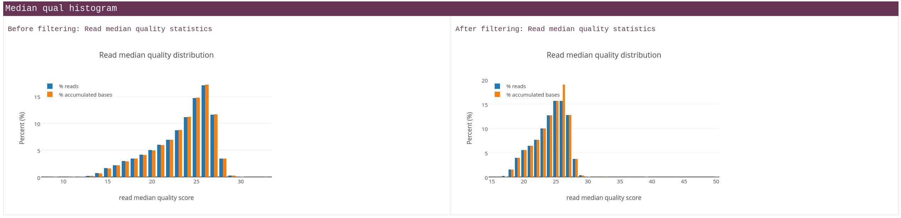
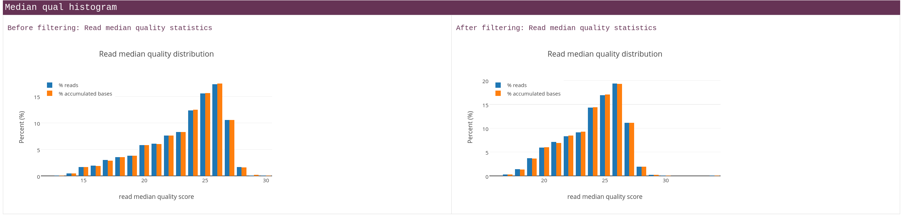

```{r setup, include=FALSE}
knitr::opts_chunk$set(echo = TRUE)
```


```{r libraries, results='hold', message=FALSE, warning=FALSE}
library(tidyverse)

```
15-03-2025:

## **Introduction** ##
The wastewater of a Kenyan water treatment plant contains many organisms whose presence influences the water quality by their production of toxins like those produced by algal blooms from Cyanobacteria. **1** These algal blooms are a global threat to freshwater systems like the Nyando River. 
Using more traditional chemical analyses, an abundance of nitrogen, phosphorus and potassium was determined.

It is imperative to measure those toxins or in this case genetic material from the micro-organisms that produce them. This wastewater is directly exhausted into the Nyando River, a basin covering about 3,590 square kilometers. The population density at the basin is higher than the national average, this indicates it’s importance. The life expectancy is very low with an average of 37.7 years for males and 42.9 years for females. Enhancing water quality could contribute to a higher lifespan for the people and other organisms that make use of these wetlands.

This water provides food, stores energy and is crucial for biodiversity. **2** These resources are threatened by wastewater from factories and treatment plants.

In the wastewater treatment facility is among other process steps a digester, with a lagoon where the  wastewater is expelled into. The influence of this digester on the microbial diversity and number will be determined.

There are a total of three samples, the first one was taken before the water enters the digester, the second inside of the digester and the last one in the lagoon before entering the Nyando River. 
We will make a comparison between these samples and we will determine if the amount of bacteria or other micro-organisms exceeds the limits for reclaimed water before and after entering the digester. Toxin producing algae can be present in the sample that exited the digester only if this was also the case before entering it. The scope of this article is limited to determining the influence of the digester in the wastewater treatment facility. So even if there already are contaminants, as long as their numbers are not increasing, the treatment process is not at fault.

Metagenomics is DNA based and can provide information about what organisms are present in the sample, this can be taxonomic and phylogenetic information. **4** Metagenomics differs from whole genome sequencing which refers to the sequencing of a single genomes.

To do this, a bio-informatics pipeline was constructed to compare these samples in which a taxonomic classification will be applied on the samples using the Kraken2 tool to check the presence of known algal bloom causing Cyanobacteria. **1**   Given the results from incubating the samples on agar plates, we hypothesize that there are toxin producing Cyanobacteria in the samples but that the digester doesn’t make a difference for the diversity and number of those organisms. 

In addition to the phylogenetic classification, there will also be an anti-biotic resistance test to determine to what antibiotic resistance genes the micro-organisms have. This will provide an overview of means to combat the bacteria found in the sample more effectively. **7**

To first assemble the microbial genomes from the metagenomic dataset, several tools can be used like Metabat, Concoct and Maxbin4. Identifying potentially up to 2000 micro-organisms in the sample can be challenging given that their average genome size would be 4 Mpb 8 Gpb of reads would have to be obtained to get an average coverage of 1x **5**.

**To-do: 16S DNA explanation.**

The diversity of the microbiome will be quantified using the alpha diversity measure. This is a formula that can be applied to calculate this measure for diversity. **6**.

Biosynthetic gene clusters (BGCs) will also be detected by mapping the reads from the Oxford Nanopore sequencer to the MiBIG database. **3** The results from that analysis will show the biosynthetic potential of the organisms to produce toxins. 


# **Pipeline** #
The different steps of the pipeline are explained below.

Overview:
1. Quality control with Fastplong
2. Trimming of adapter sequences with Fastplong
3. Taxonomic classification with Kraken2
4. Visualization of Kraken2 results using Kurona / Pavian 
5. Functional analysis of the micro-organisms found


## 1. Sample preparation ##

Samples: 

| # | Condition |
|---|------------|
| 1 | In lag, + glyc, - schud |
| 2 | In lag, + glyc, + schud |
| 3 | In lag, - glyc, - schud |
| 4 | In lag, - glyc, + schud |
| 5 | Out lag, + glyc, -schud |
| 6 | Out lag, + glyc, + schud |
| 7 | Out lag, - glyc, - schud |
| 8 | Out lag, - glyc, + schud |
| 9 | Dig, + glyc, + schud |
| 10 | Dig, + gly, + schud |
| 11 | Dig, -gly, -schud |
| 12 | Dig, - gly, +schud |

The three groups: In the lagoon, Outside of the lagoon and in the digester. 
Some samples have been treated with glycerol in order to better preserve the sample in the -80 freezer. 

As per usual with Nanopore results, the samples were distributed over many seperate .fastq files. These were combined using the following bash script:

First, to combine all fastq files for every barcode.
```{bash eval = F}
cat barcode01/*.fastq.gz > /students/2024-2025/Thema07/metagenomics/wastewater/data/barcode01.fastq
cat barcode02/*.fastq.gz > /students/2024-2025/Thema07/metagenomics/wastewater/data/barcode02.fastq
cat barcode03/*.fastq.gz > /students/2024-2025/Thema07/metagenomics/wastewater/data/barcode03.fastq
cat barcode04/*.fastq.gz > /students/2024-2025/Thema07/metagenomics/wastewater/data/barcode04.fastq
cat barcode05/*.fastq.gz > /students/2024-2025/Thema07/metagenomics/wastewater/data/barcode05.fastq
cat barcode06/*.fastq.gz > /students/2024-2025/Thema07/metagenomics/wastewater/data/barcode06.fastq
cat barcode07/*.fastq.gz > /students/2024-2025/Thema07/metagenomics/wastewater/data/barcode07.fastq
cat barcode08/*.fastq.gz > /students/2024-2025/Thema07/metagenomics/wastewater/data/barcode08.fastq
cat barcode09/*.fastq.gz > /students/2024-2025/Thema07/metagenomics/wastewater/data/barcode09.fastq
cat barcode10/*.fastq.gz > /students/2024-2025/Thema07/metagenomics/wastewater/data/barcode10.fastq
cat barcode11/*.fastq.gz > /students/2024-2025/Thema07/metagenomics/wastewater/data/barcode11.fastq
```
Combining multiple barcodes into three samples according to the group they are in (In lagoon, out lagoon and digester)


```{bash eval = F}
# Combining all barcodes for the "In lagoon" sample:
cat barcode01.fastq barcode02.fastq barcode03.fastq barcode04.fastq  > /students/2024-2025/Thema07/metagenomics/wastewater/data/in_lagoon.fastq

# The same was done for the "Out lagoon" sample:
cat barcode05.fastq barcode06.fastq barcode07.fastq barcode08.fastq  > /students/2024-2025/Thema07/metagenomics/wastewater/data/out_lagoon.fastq

# And the "Digester" sample:
cat barcode09.fastq barcode10.fastq barcode11.fastq barcode12.fastq  > /students/2024-2025/Thema07/metagenomics/wastewater/data/digester.fastq
```


## **1. Quality control** ##
To check the quality of the raw sequence data, Fastplong was used. This tool uses

### **1.1 Results** ###

The sample taken from the digester only contained 2 reads before filtering with Fastplong and 1 after. 


| Statistic         | Before Filtering        | After Filtering         |
|-----------------|-------------------------|-------------------------|
| Total Reads       | 2                       | 1                       |
| Total Bases       | 1.873000 K             | 507                     |
| Minimum Length    | 507                     | 507                     |
| Maximum Length    | 1.366000 K             | 507                     |
| Median Length     | 1.366000 K             | 507                     |
| Mean Length       | 936                     | 507                     |
| N50 Length        | 1.366000 K             | 507                     |
| GC Content        | 54.458089%              | 51.676529%              |
| Q5 Bases          | 1.796000 K (95.888948%) | 490 (96.646943%)       |
| Q7 Bases          | 1.631000 K (87.079552%) | 457 (90.138067%)       |
| Q10 Bases         | 1.358000 K (72.504004%) | 378 (74.556213%)       |
| Q15 Bases         | 1.107000 K (59.103043%) | 309 (60.946746%)       |
| Q20 Bases         | 874 (46.663107%)        | 234 (46.153846%)       |
| Q30 Bases         | 248 (13.240790%)        | 62 (12.228797%)        |
| Q40 Bases         | 0 (0.000000%)           | 0 (0.000000%)           |


The sample taken from inside the lagoon has ~18K reads after filtering. 


| Statistic         | Before Filtering          | After Filtering          |
|-------------------|---------------------------|--------------------------|
| Total Reads       | 20.242000 K               | 18.042000 K              |
| Total Bases       | 28.870993 M               | 23.485654 M              |
| Minimum Length    | 3                         | 17                       |
| Maximum Length    | 13.903000 K               | 13.903000 K              |
| Median Length     | 1.452000 K                | 1.320000 K               |
| Mean Length       | 1.426000 K                | 1.301000 K               |
| N50 Length        | 1.453000 K                | 1.322000 K               | 
| GC Content        | 53.655196%                | 53.160078%               |
| Q5 Bases          | 28.257982 M (97.876724%)  | 23.065575 M (98.211338%) |
| Q7 Bases          | 26.944736 M (93.328054%)  | 22.133635 M (94.243213%) |
| Q10 Bases         | 24.666336 M (85.436396%)  | 20.436812 M (87.018279%) |
| Q15 Bases         | 21.538507 M (74.602585%)  | 18.037896 M (76.803891%) |
| Q20 Bases         | 18.308551 M (63.415037%)  | 15.468003 M (65.861496%) |
| Q30 Bases         | 5.359630 M (18.564065%)   | 4.511358 M (19.208995%)  |
| Q40 Bases         | 12.277000 K (0.042524%)   | 10.494000 K (0.044683%)  |


And the last sample, taken when the water had exited the lagoon. 


| Statistic         | Before Filtering         | After Filtering          |
|-------------------|--------------------------|--------------------------|
| Total Reads       | 2.410000 K               | 2.164000 K               |
| Total Bases       | 3.400336 M               | 2.855180 M               |
| Minimum Length    | 3                        | 17                       |
| Maximum Length    | 2.075000 K               | 2.075000 K               |
| Median Length     | 1.435000 K               | 1.298000 K               |
| Mean Length       | 1.410000 K               | 1.319000 K               |
| N50 Length        | 1.436000 K               | 1.309000 K               |
| GC Content        | 54.223112%               | 53.883748%               |
| Q5 Bases          | 3.327345 M (97.853418%)  | 2.802639 M (98.159801%)  |
| Q7 Bases          | 3.172289 M (93.293398%)  | 2.687310 M (94.120511%)  |
| Q10 Bases         | 2.901834 M (85.339625%)  | 2.477674 M (86.778207%)  |
| Q15 Bases         | 2.530093 M (74.407147%)  | 2.181687 M (76.411540%)  |
| Q20 Bases         | 2.145847 M (63.106911%)  | 1.865486 M (65.336896%)  |
| Q30 Bases         | 592.594000 K (17.427513%)| 519.403000 K (18.191603%)|
| Q40 Bases         | 1.333000 K (0.039202%)   | 1.168000 K (0.040908%)   |


In the tables above, the N50 length is the largest lenght L such that 50% of all nucleotides are contained in contigs of size at least L. (source: https://www.nature.com/articles/35057062)

Q5, Q7, Q10 etc. bases is the value of the number of bases at each quality level (Phred score). 


The figure above displays the difference in read quality before and after filtering with Fastplong. 
The amount of reads was reduced but the quality increased. Perhaps the reads with a lower phred score would suffice but I chose to remove them in order to have more statistical power in the downstream analyses like in Kraken2.



The same was done with the sample from the water that had exited the lagoon. The digester sample contained only one read after filtering so displaying this graph would be meaningless.

The rule in snakemake takes all the samples from the config.yaml used for all the rules. 
FastPlong generates both a .html report for the quality control and a fastq file that has been trimmed. (adapter sequences removed and low quality reads removed)
The standard error is redirected to the logs/QC/ directory for every individual sample. 

```{snakemake, eval=F}

rule fastq_qc_plong:
    input:
        lambda wildcards: config["samples"][wildcards.sample]
    output:
        fastq="trimmed/{sample}.fastq",
        html="QC/{sample}_fastplong_QC.html"
    log:
        "logs/QC/{sample}.log"
    shell:
        """
        tools/fastplong \
        -i {input} \
        -o {output.fastq} \
        -h {output.html} \
        2> {log}
        """

```


## **2. Taxonomic classification** ##
To classify all the reads as belonging to a species or less specific taxon, Kraken2 was used. 

### **Tool Comparison** ###
This tools was chosen based on a comparison made in the following article, (@ye_benchmarking_2019)
Kraken2 is 


### **Visualization of Kraken2 results** ###
A script to generate a Sankey graph based on the report from Kraken2 was used. 


## **Citations** ##
**To-do: use .bib file for this...**

1. 
 https://www.zotero.org/groups/5870913/acfc_afvalwater/items/WLVUDDXJ/attachment/RHY85NTI/reader
 
2. https://www.zotero.org/groups/5870913/acfc_afvalwater/items/DW2JTKTX/reader

3. biosynthetic gene clusters. Nucleic Acids Res 51:D603–D610. https:// doi.org/10.1093/nar/gkac1049

4. https://www.zotero.org/groups/5870913/acfc_afvalwater/items/F3R5L7PV/attachment/6YZYPRXC/reader

5. is the treated wastewater safe to reuse for agricultural irrigation? Water Res 73:277–290. https://doi .org/10.1016/

6. Best practices for analysing microbiomes. Nat Rev Microbiol 16:410 – 422. https://doi.org/10.1038/s41579-018-0029-9.

7. Platforms for elucidating antibiotic resistance in single genomes and complex metagenomes. Environ Int 138:105667. https://doi.org/10.1016/j.envint.2020.105667.


Fastplong
Shifu Chen. 2023. Ultrafast one-pass FASTQ data preprocessing, quality control, and deduplication using fastp. iMeta 2: e107. https://doi.org/10.1002/imt2.107

Kraken2 visualization script:
https://github.com/lorenzgerber/krakenSankey

Taxonomic_classifier_tool_comparison
Ye, S. H., Siddle, K. J., Park, D. J., & Sabeti, P. C. (2019). Benchmarking Metagenomics Tools for Taxonomic Classification. Cell, 178(4), 779–794. https://doi.org/10.1016/j.cell.2019.07.010

