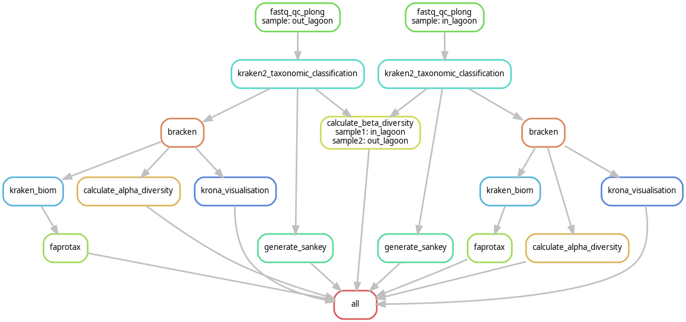

# Setup

```{r setup, include=FALSE}
knitr::opts_chunk$set(
  echo = TRUE,                   # Show code
  warning = FALSE,               # Hide warnings
  message = FALSE,               # Hide package messages
  fig.path = "figures/",         # Save figures in subfolder
  cache = TRUE,
  python.reticulate = FALSE
)
```

# Tools

# Introductie

For this metagenomics project our group was asked to look what microbial
community lives in the waste water from a Molasses-Based Spirit and
Yeast Production Factory. The waste water samples we're taken from 3
stages. The waste water straight from the factory, within the digester
(a closed container utilising anaerobic bacteria to break down organic
material and produce methane) and from the exit of the lagoon where the
water flows back into the river. These samples we're sequenced with
minION but due to a problem with it's flowcell our digester sample
turned out bad. Therefore we have chosen to no include it in this
research. Using Snakemake we created a pipeline that trims and checks
the sample quality. this was done using `Fastplong` @fastplong, Then the
data was ran through a tool called `Kraken2` @Wood2019 this is a
computational tool for microbial classification. This gave kreports
(kraken reports) and kraken.out files that were used to make
visualizations. `Kronatools` @Ondov2011 was used to make some Krona
charts, Krona visualises classification data in a multi-layered pie
chart. These charts are interactive and can be viewed within a
webbrowser @Krona The visualisation that follows from using this tool
could prove as a nice overview of the classification, for in our paper.
(for more info look at Logbook - Yamila). Another visualisation that was
used was a sankey plot, The custom Snakemake workflow for generating
taxonomic Sankey charts was developed with guidance from
DeepSeek-R1-Lite-Preview, a large language model @deepseek2024 . A
functional analysys was then made with the Kraken2 output, The
classified species were compared to the FAPROTAX database and from there
certain (metabolic) pathways were found. This was key our functional
analysis

## Research question

What Microbial Community live in an Anaerobic Reactor for the Treatment
of Wastewater from a Molasses-Based Spirit and Yeast Production Factory

# Inhoud

-   [Introduction](#Abstract)
-   [Material & Methods](#Mat-en-Meth)
-   [Snakemake](#Snakemake)

Goals: Find tools that will build our pipeline Find What our pipeline
needs to do Write material and methods Clear up our question from our
supervisor

## March 4th

Setting up a github project to devide the tasks among the team members

The tasks: Write materials - Jarno\
Write Methods - Jarno\
**Snakemake**\
Fastplong - Floris\
kraken2 - Yamila\
KronaTools - Yamila   Funtional analysis tools (bubble plot /
fastprotax) Floris\
Shannon index for alpha diversity + beta diversity- Jarno\
Presentation -conlusion and discussion needs to be written by everyone

## March 6th

First Version and back ground research for the materials and methods \##
background info for the usage of the tools

**FastQC Quality control**\
FastQC is used to check the quality of raw data, determining if the data
is ready for use or needs trimming. The trimmer can also be adjusted
based on FastQC results. [@BabrahamBioinformatics]

We use FastQC to ensure the data is suitable for analysis. Poor-quality
data can lead to unreliable and non-reproducible results.

Below is a breakdown of the results from a FastQC check and how to
interpret them.

| Category                         | Result                                                                                                                                      | How to Interpret                                                                                                                                                                                                                                                                                                                                                         |
|-------------------|-------------------|----------------------------------|
| **Basic Statistics**             | A table with details such as Filename, File Type, Sequence Length, %GC, Total Sequences, Encoding, and Sequences Flagged as Poor Quality.   | Read and check the table for errors.                                                                                                                                                                                                                                                                                                                                     |
| **Per Base Sequence Quality**    | A graph (see Figure 1).                                                                                                                     | The graph has three colored zones: 28-40 (green, good quality), 20-28 (yellow/orange, moderate quality), and 0-20 (red, poor quality). The yellow box represents the 25th to 75th percentile, the black lines show the 10th and 90th percentiles, and the blue line represents the average quality score. A drop in quality after base 100 indicates trimming is needed. |
| **Per Tile Sequence Quality**    | A heatmap plot showing read quality per tile and position.                                                                                  | Dark blue tiles indicate good quality, while lighter tiles indicate poorer quality. The Y-axis shows the tile number, and the X-axis shows the position.                                                                                                                                                                                                                 |
| **Per Sequence Quality Score**   | A graph showing the average quality score (x-axis) and the number of sequences with that score (y-axis).                                    | Ideally, most reads should have a high average quality score without significant dips, indicating low quality.                                                                                                                                                                                                                                                           |
| **Per Base Sequence Content**    | A plot showing the percentage of each base (A, T, C, G) at each position in the read.                                                       | Significant variation at the beginning (positions 1-10) may indicate sequencing bias. Stabilization after position 10 suggests higher quality in the rest of the reads.                                                                                                                                                                                                  |
| **Per Sequence GC Content**      | A plot with two lines: a blue line (theoretical distribution) and a red line (observed GC content).                                         | Ideally, the two lines should overlap or be close. Multiple peaks or deviations from the theoretical line may indicate contamination or sequencing errors. A red cross indicates abnormal GC content compared to expectations.                                                                                                                                           |
| **Per Base N Content**           | A graph showing the frequency of "N" base calls (unknown nucleotides) at each position.                                                     | A high percentage of "N" at any position indicates uncertainty in base calling. The standard is \<1%. Deviations may indicate sequencing issues, often at the start or end of reads.                                                                                                                                                                                     |
| **Sequence Length Distribution** | A graph showing the distribution of read lengths.                                                                                           | Ideally, there should be a sharp peak at the expected read length (e.g., 150 bp). Multiple peaks or a wide spread may indicate sequencing errors, poor adapter trimming, or DNA degradation.                                                                                                                                                                             |
| **Sequence Duplication Levels**  | A graph showing the percentage of sequences that occur more than once.                                                                      | A sharp drop in the graph indicates most reads have a duplication level of 1. Large differences between the red (duplicated sequences) and blue (total sequences) lines suggest technical artifacts like PCR duplication. High duplication levels can affect downstream analyses.                                                                                        |
| **Overrepresented Sequences**    | A table listing sequences (≥20 bp) that occur more than 0.1% of the total sequences, along with their count, percentage, and likely source. | If abnormalities are seen in the Per Sequence GC Content graph, this table can help identify the source. Sequences not matching known adapters or vectors can be BLASTed for identification.                                                                                                                                                                             |
| **Adapter Content**              | A graph showing the presence of adapter sequences at different positions.                                                                   | Adapter fragments can be identified and trimmed. The graph helps identify the positions of adapters for removal.                                                                                                                                                                                                                                                         |

This info was found on the fastqc website -
@babraham_bioinformatics_fastqc

**Trimmomatic - got turned into fastplong**

Trimmomatic (version x.x) is a versatile and robust tool for the
processing of sequence data, proficient in managing both paired-end and
single-end datasets. The software encompasses a series of trimming steps
accompanied by an array of customizable parameters aimed at optimizing
data quality. As a command-line application, Trimmomatic is especially
advantageous for addressing complexities associated with the
"collapsing" and "trimming" of paired-end reads, particularly in cases
where sequencing fragments are shorter than the read length, which can
lead to undesirable overlaps with adapter sequences present at the
terminal ends of the reads. Ensuring data integrity during the cleaning
process is a fundamental feature of Trimmomatic. The necessity of data
trimming arises predominantly from the presence of low-quality sequence
data. Enhancing data quality is critical, as the extraction of reliable
conclusions is jeopardized by the prevalence of errors often associated
with poor-quality inputs. Trimmomatic's customizable framework allows
for the efficient removal of adapter sequences, while also enabling
specific adjustments tailored to the dataset in question.

**Taxonomische classificatie met Kraken 2**

Kraken 2 is a taxonomic classification system that uses k-mer matches to
get high accuracy and fast classification speeds. A k-mer is a substring
of length k contained within a biological sequence. Simply said, k-mers
are simply length k subsequences. 1-k k-mers are G, T, A, C. 2-k k-mers
are GT, TA, AG, GA, AG, GC, CT, TG, GT. Using the matching principle,
kraken 2 doesn’t have to read the full sequence and can quickly
determine whether a species matches or not.

Kraken 2 will read each sequence and match them to their complementary
counterpart. Giving us the Taxonomy as far as is known for each
microorganism. Helping understand what the water contains.

The output for kraken 2 is a single line of output with five
tab-delimited fields; from left to right they are: “C”/”U”: a one letter
code indicating that the sequence was either classified or unclassified,
The sequence ID, obtained from the FASTA/FASTQ header. The taxonomy ID
Kraken 2 used to label the sequence; this is zero if the sequence is
unclassified. The length of the sequence is in base pairs. In the case
of paired read data, this will be a string containing the lengths of the
two sequences in bp, separated by a pipe character, e.g. “98\|94”.
Lastly, a space-delimited list indicating the LCA mapping (lowest common
ancestor)

**Visualisations of the classification with Pavian** Pavian is an
interactive browser application that analyzes and visualizes
metagenomics classification results from classifiers such as Kraken,
KrakenUniq, Kraken 2, Centrifuge, and MetaPhlAn. Pavian also provides an
alignment viewer to validate matches to a particular genome. The
seamless implementation with Kraken 2 makes this a good choice for
visualisation. The visualisations that are made with Pavian are a
taxonomic classification chart, a Sankey diagram, and an alignment
viewer.

**Diversity analysis using QIIME 2(Shannon index for alpha diversity)**
QIIME 2 is a powerful, extensible and decentralized microbiome analysis
package with a focus on data and analysis transparency. QIIME 2 enables
researchers

**Feedback** *Instead of reposting the old materials and methods i will
only be putting down the feedback to prevent long re-reads.* - Use past
tense and fix the dual use - Fix the issue about naming “pathogenic
organisms in the lagoon” this is because we want to know what will flow
in the river. Therefore we want to specifically know what kind of
organisms live in the lagoon output, not the lagoon middle. - Make use
of more commas and interpunctions in general. - Change the main focus
from “dangerous microorganisms” to identifying the microbiome of the
lagoon and a global overview of what lives in the three different
steps + what they do. - Fix the following sentence “Using this, we were
able to see the dangers and problems the microorganisms cause in the
lagoon” this needs to be fixed because there arent problems within the
lagoon the problem is what is exciting the lagoon into the river. -
Explanation of the usage of BGP.

## March 8th

Second feedback on the materials and methods, This time from my team
members and the teacher.

General feedback: Make an overall approach that quickly summarises your
whole pipeline. Fix the over-quoting and remove the ones that aren’t
necessary. Fix spelling isues and make sure the sentences are normal
with an academic tone Add data collection tab that explains how the data
was collected and in our case how it was sequenced + with what settings.

**9th of march** *This is the final version for now, it still is missin
gour data collection due to not being emailed back about it yet.*

## 2. Materials and methods 

#### 2.1 overal approach 

The sequencing data obtained from the MinION platform underwent a
quality assessment process. Initially, the sequences were evaluated for
quality using `Fastplong` (OpenGene, 2023) (Chen et al., 2018). After
this, `Fastplong` also trimmed the data according to the generated
reports. Following this, a secondary quality assessment was conducted
using `Fastplong` to ensure improved data quality. The refined dataset
was then subjected to taxonomic classification through `Kraken2` (Wood
et al., 2019), a computational tool for microbial classification. The
results generated by `Kraken2` were then visualised using `KronaTools`
(Ondov et al., 2011) and `Pavian` (Breitwieser & Salzberg, 2020),
facilitating an interactive and intuitive representation of the
taxonomic distribution. Other tools like `HUMAnN 3.0` (Beghini et al.,
2021) were used for profiling the abundance of microbial metabolic
pathways and other molecular functions from metagenomics data (Beghini
et al., 2021). Furthermore, the outcomes obtained from the `Kraken2`
analysis were employed to identify the microorganisms present in the
lagoon water, this allowed comparing the different lagoon stages and
their microbiomes. To get more insight into the data using `QIIME2`
(Bolyen et al., 2019b), a tool that made a Shannon index for alpha
diversity, this index showed the species diversity in each sample. This
index also showed the distribution of the species in the samples. With
all this information, an analysis for each stage of the lagoon has been
made.

#### 2.2 Data collection

(added later) at this point it was still unknown

### 2.3 The metagenomics pipeline

#### 2.3.1 **Data Preprocessing and Quality Control**

Raw sequencing data has been received in the FASTQ format, this data was
preprocessed using `fastplong` . A specialized version of the fastp tool
optimised for Nanopore long-read data, adapter and low quality reads
(Phred score \< 20) were trimmed, and reads shorter than 50 bp were no
longer used to ensure the high-quality and keep the data integrity high
for the downstream analysis. After this first trim, the data was
assessed to see if the data quality had improved again using
`fastplong`. It was concluded that the data did not need more trimming,
allowing the next step to proceed.

#### 2.3.2 Identifying microorganisms using taxonomic classification

The processed FASTQ files were run through the pipeline's next step,
`Kraken2`. `Kraken2` was used to get the taxonomic classification of
each found microorganism. This was done by matching k-mer sequences
(nucleotide sequences), giving `Kraken2` high accuracy. The output file
has a certain structure with some important things like the taxonomy ID,
whether a sequence was classified or not and a list containing the
lowest common ancestor. The identities of the present microorganisms
were revealed by their taxonomy ID, however, reading each ID and
searching these up would be quite inefficient. This will be solved with
the visualisation step, which takes these IDs and visualises them.

#### 2.3.3 Visualisation of kraken2 results

To visualise what has been found from the Taxonomic classification of
the `Kraken2` tool, we used a multitude of different tools, `KronaTools`
was used to create krona plot, a krona plot shows all taxonomic levels
based on the NCBI taxonomy starting from superkingdom to family level
and the associated abundances based on the number of identified spectra
summed over all BGPs (Bacterial Gene Product). This was used in the
paper to show what had been found in an easy to interpret way. `Pavian`
was used to create an interactive browser application that analysed and
visualised metagenomics classification results from classifiers such as
`Kraken2`. `Pavian` also provided an alignment viewer to validate
matches to a particular genome. Specific visualisations that could be
found in the browser application are: a taxonomic classification chart,
a Sankey diagram, and the alignment viewer.

#### 2.3.4 Other visualisations

`HUMAnN 3.0` was used to profile the abundance of microbial metabolic
pathways and other molecular functions from the data. This showed the
metabolic potential of the microbial community that was present in the
lagoon samples. This helped us answer the question of “What are the
microorganisms in the lagoon doing or capable of doing?”. `QIIME2`, a
tool that made a Shannon index for alpha diversity, this index showed
the species diversity in each sample. This index also showed the
distribution of the species in the samples. After it was clear what the
distribution was of these microorganisms, we could build a microbiome
structure for each step in the lagoon. These structures have been used
to answer the questions about the lagoon, “*Not clear yet*”

#### **Refrences**

**2.2.1 Data quality control and trimming** **Fastplong** - @fastplong

**2.2.2** Identifying microorganisms using taxonomic classification -
@Kraken2 @Wood2019Kraken2

**2.2.3 Visualisation of kraken2 results**

**KronaTools** - @Krona

**Pavian** - (version x.x), made by - Florian P Breitwieser, Steven L
Salzberg, Pavian: interactive analysis of metagenomics data for
microbiome studies and pathogen identification, *Bioinformatics*, Volume
36, Issue 4, February 2020, Pages
1303–1304, <https://doi.org/10.1093/bioinformatics/btz715> Used to
create an interactive analysis of metagenomics data - (removed in final
version)

**HUMAnN 3.0** - (version x.x), made by - Francesco Beghini1 ,Lauren J
McIver2 ,Aitor Blanco-Mìguez1 ,Leonard Dubois1 ,Francesco
Asnicar1 ,Sagun Maharjan2,3 ,Ana Mailyan2,3 ,Andrew Maltez
Thomas1 ,Paolo Manghi1 ,Mireia Valles-Colomer1 ,George
Weingart2,3 ,Yancong Zhang2,3 ,Moreno Zolfo1 ,Curtis Huttenhower2,3,Eric
A Franzosa2,3 ,Nicola Segata1,4

[Integrating taxonomic, functional, and strain-level profiling of
diverse microbial communities with bioBakery
3](https://doi.org/10.7554/eLife.65088)

[eLife 2021;10:e65088](https://doi.org/10.7554/eLife.65088)

1 Department CIBIO, University of Trento, Italy\
2 Harvard T. H. Chan School of Public Health, Boston, MA, USA\
3 The Broad Institute of MIT and Harvard, Cambridge, MA, USA\
4 IEO, European Institute of Oncology IRCCS, Milan, Italy

Used to profile the abundance of microbial metabolic pathways and other
molecular functions. - (removed in final version)

**QIIME2** - (version x.x), made by - Bolyen, E., Rideout, J. R.,
Dillon, M. R., Bokulich, N. A., Abnet, C. C., Al-Ghalith, G. A.,
Alexander, H., Alm, E. J., Arumugam, M., Asnicar, F., Bai, Y., Bisanz,
J. E., Bittinger, K., Brejnrod, A., Brislawn, C. J., Brown, C. T.,
Callahan, B. J., Caraballo-Rodríguez, A. M., Chase, J., . . . Caporaso,
J. G. (2019). Reproducible, interactive, scalable and extensible
microbiome data science using QIIME 2. *Nature Biotechnology*, *37*(8),
852–857. <https://doi.org/10.1038/s41587-019-0209-9> Used for the
creation of a Shannon index for alpha diversity. (plugin) - (removed in
final version)

**External tools**

**R** - (version x.x), made by - R Core Team (2021). R: A language and
environment for statistical computing. R Foundation for Statistical
Computing, Vienna, Austria. URL <https://www.R-project.org/>. Used for
statistical computing, writing the code, and creating plots about the
data.

**Rstudio** - (version x.x), made by - RStudio Team (2020). RStudio:
Integrated Development for R. RStudio, PBC, Boston, MA
URL <http://www.rstudio.com/>.\
Used as an interface, also known as the IDE for the R programming
software and Rmarkdown.

## March 10th

**Recieved study concept** Due to our study leader at the hanze having
to drop out, we made direct contact with the person at AFAC who
collected the samples and guided the studies there.

### Study concept AFAC

**Study Concept: Investigating Microbial Community in an Anaerobic
Reactor for the Treatment of Wastewater from a Molasses-Based Spirit and
Yeast Production Factory**

**1.**     **Introduction**

The production of industrial spirits and yeast from molasses generates a
significant volume of high-strength wastewater rich in organic matter,
nutrients, and recalcitrant compounds. Anaerobic digestion is a
promising biological treatment technology for such wastewater, as it
facilitates organic matter degradation while producing biogas as a
valuable byproduct. However, the efficiency and stability of anaerobic
treatment largely depend on the composition and dynamics of the
microbial community involved in the process. This study aims to
investigate the microbial consortia within an anaerobic reactor treating
wastewater from a molasses-based spirit and yeast production factory to
enhance reactor performance and stability.

**2.**     **Problem Statement**

Despite the widespread application of anaerobic digestion for treating
molasses-based wastewater, challenges such as process instability,
incomplete degradation of organic pollutants, and low methane yield
persist. These challenges are often linked to shifts in microbial
community structure and function within the reactor. Understanding the
microbial diversity, interactions, and metabolic pathways in the system
is crucial for optimizing treatment performance, improving process
resilience, and maximizing energy recovery.

**3.**     **Objectives**

The study will focus on the following objectives:

-   To characterize the microbial community structure in an anaerobic
    reactor treating molasses wastewater.
-   To analyze the functional roles of key microbial species in organic
    matter degradation and methane production.
-   To assess the impact of operational conditions on microbial
    diversity and reactor performance.
-   To explore potential strategies for improving microbial activity and
    process efficiency.

**4.**     **Methodology**

-   **Sample Collection:** Wastewater and sludge samples will be
    collected from different reactor compartments over a defined
    operational period.

-   **Physicochemical Analysis:** Key parameters such as pH, COD, BOD,
    VFA, alkalinity, and methane yield will be monitored.

-   **Microbial Analysis:**

-   DNA extraction from reactor biomass samples.

-   High-throughput sequencing (e.g., 16S rRNA gene sequencing) to
    identify microbial taxa.

-   Metagenomic and metatranscriptomic analysis to determine functional
    gene profiles.

-   Fluorescence in situ hybridization (FISH) and qPCR for quantitative
    assessment of key microbial groups.

-   **Data Analysis:** Bioinformatics tools will be used to analyze
    sequencing data, determine microbial community diversity indices,
    and establish correlations between microbial populations and reactor
    performance.

**5.**     **Expected Outcomes**

-   Identification of dominant microbial taxa involved in organic matter
    degradation and methanogenesis.
-   Insights into microbial interactions and metabolic pathways critical
    for process stability.
-   Correlation between microbial community shifts and operational
    performance.
-   Recommendations for optimizing anaerobic reactor conditions for
    enhanced treatment efficiency and biogas production.

**6.**     **Significance of the Study**

The findings will contribute to a better understanding of microbial
ecology in anaerobic reactors treating molasses wastewater. The insights
gained will support the development of strategies for process
optimisation, leading to improved wastewater treatment, enhanced biogas
recovery, and reduced environmental impact.

**7.**     **Conclusion**

This study will provide valuable knowledge on the microbial community
dynamics in anaerobic digestion systems treating molasses wastewater.
The outcomes will help improve anaerobic reactor design and operational
strategies, ultimately contributing to sustainable industrial wastewater
management and renewable energy generation.

### What does this mean for us?

We now know the exact problem, this being: “Instability and incomplete
degradation of organic pollutants + low methane yield persist in the
digestor”.

The goal of this project is: “Understanding the microbial diversity,
interactions, and metabolic pathways will help optimise performance,
improve resilience and maximise energy recovery from the digestor”

## 14th of march

*Starting my part of the snakemake pipeline*

Finding the right tools was difficult, this was because there wasn’t
allot of documentation regarding QIIME2 in snakemake. There was no
wrapper either so i had to find out all the steps necesarry for the
shannon index for alpha diversity.

using the QIIME2 docs and forums, I found there were a few steps before
the \# Snakemake

Snake make will be used to create a pipeline for our project. This
pipeline must do the following: - Check the quality of the data and if
needed trim it. - Identify the microorganisms that are in the data with
taxonomic classification - Visualise the results of the taxonomic
classification - Show the diversity of what the samples contain

18 mrt **Qiime2 - First version (not chosen)**

```{python, eval=FALSE}

SAMPLES = ["forward"]

  

rule all:

input:

expand("data/samples_afac/{sample}-imported.qza", sample=SAMPLES), # Updated to match the new output from fasta_to_qza

expand("data/samples_afac/{sample}-clustered-table.qza", sample=SAMPLES),

expand("data/samples_afac/{sample}-clustered-rep-seqs.qza", sample=SAMPLES)

  
  
  

rule fasta_to_qza:

input:

"data/samples_afac/"

output:

"data/samples_afac/{sample}-imported.qza"

shell:

"qiime tools import "

"--type 'MultiplexedSingleEndBarcodeInSequence' "

"--input-path {input} "

"--output-path {output}"
```

For the qiime2 pipeline our fastq file had to be turned into a qza file,
then it had to be trimmed and denoised (at this step it was found out
that the denoiser had an immense amount of struggle due to out data
being from the minION) after that it needed a feature table, then after
generating all these files a shannon index for alpha diversity could be
created.

I struggled allot with the change of file format, after getting this
done though i moved on using the qza file to try and denoise it but this
took me multiple hours to figure out this was due to the assemblix
server having an old version of chime. For this reason it was quite hard
to find working solutions to my problem and i had to mostly rely on the
documentation that could be found

```{python, eval=FALSE}
rule denoise_sequences:
    input:
        demux="demux.qza"
    output:
        table="feature-table.qza",  
        rep_seqs="rep-seqs.qza",    
        stats="stats.qza"
    conda:
        "envs/qiime2.yaml"
    shell:
        "qiime dada2 denoise-paired "
        "--i-demultiplexed-seqs {input.demux} "
        "--o-table {output.table} "
        "--o-representative-sequences {output.rep_seqs} "
        "--o-denoising-stats {output.stats} "
        "--p-trim-left-f 20 --p-trim-left-r 20 "  
        
```

This was what i could come up with it took me quite a while and the test
env had allot of struglle. So i started searching why, and it seemed
that the minION sequences were poorly optimised for the denoiser of this
qiime2 version for this reason i started looking for alternative
solutions

## March 20th

**Snakemake rules for calculation of alpha and beta diversity** This
build was done in a test enviroment on assemblix where i had a test
folder in my documents on my personal home. In this folder i had a data
map and using that env i started experimenting with qiime2 and the
diversity scripts.

```{python, eval=FALSE}
SAMPLES, = glob_wildcards("data/kraken2/{sample}.kraken")

rule all:
    input:
        expand("results/{sample}_alpha.txt", sample=SAMPLES),
        "results/beta_diversity.txt"

rule alpha_diversity:
    input:
        "data/kraken2/{sample}.kraken"
    output:
        "results/{sample}_alpha.txt"
    shell:
        "python alpha_diversity.py -f {input} -a BP %3E {output}"

rule beta_diversity:
    input:
        expand("results/{sample}_alpha.txt", sample=SAMPLES)
    output:
        "results/beta_diversity.txt"
    shell:
        "python beta_diversity.py -i {input} --type bracken > {output}"
```

The reason for using the Python script over the QIIME2 is efficiency due
to it being able to use the bracken files that are generated with the
kraken2 tool. It also makes the pipeline less complex. For the alpha
diversity only the bracken files we're allowed but for the beta
diversity a variety of input file formats were accepted. This included
also the kraken2 output reports giving more freedom in choosing what
beta diversity needs to be calculated from.

The alpha_diversity.py had different ways of calculating the alpha
diversity, we chose to use the shannon index in the end but here the BP
is used this means brillouin index. i will explain all the options given
by the script in table 1

| Name                        | What does it mean                                                                                               |
|---------------------------|---------------------------------------------|
| BP (Brillouin index)        | Similar to Shannon but used when the community is sampled exhaustively (no randomness assumed).                 |
| Sh (Shanon-wiener index)    | species richness and evenness (how evenly individuals are distributed among species)                            |
| Si (simpson index)          | Measures dominance (probability that two randomly selected individuals belong to the same species).             |
| ISi (Inverse simpson index) | Represents the effective number of species (how many equally abundant species would produce the same diversity) |
| F (Fisher's Alpha)          | A parameter from Fisher’s logarithmic series model, used to estimate diversity in highly uneven communities.    |

: Table 1:Explaining alpha diversity calculation

**Formulas**

***Shannon index***

$$ H' = -\sum_{i=1}^{S} p_i \ln p_i $$

$$
Pi = \frac{ni}{N}
\ (proportion\ of\ species) 
$$

$$
ni = \ number \ of \ species\ i
$$

$$
N = total \ number\ of\ indivuals
$$

$$
S = total \ number\ of \ species
$$

***Brillouin Index***
$$ HB = \frac{\ln N! - \sum_{i=1}^{S} \ln n_i!}{N} $$

$$
N! = factorial \ of\ total\ indivuals
$$

$$
ni = \ factorial \ of \ individuals\ in \ species\ i
$$

***Simpson's Index (original)*** $$ \lambda = \sum_{i=1}^{S} p_i^2 $$

***Simpson's Diversity (1 - λ)***
$$ D = 1 - \lambda = 1 - \sum_{i=1}^{S} p_i^2 $$

***Inverse Simpson***
$$ \frac{1}{\lambda} = \frac{1}{\sum_{i=1}^{S} p_i^2} $$

***Fisher's Alpha***
$$ S = \alpha \ln \left(1 + \frac{N}{\alpha}\right) $$

$$
N = total \ number\ of\ indivuals
$$

$$
S = species\ richness
$$

## 25 mrt 

The alpha diversity is fully working but there are some problems with
the beta diversity settings and inputs

```{python, eval=FALSE}

SAMPLES, = glob_wildcards("data/bracken/{sample}.out")

SAMPLES_REPORT, = glob_wildcards("data/bracken/{sample}.txt")

  
  

rule all:

input:

expand("results/{sample}_alpha.txt", sample=SAMPLES),

expand("results/{sample}_beta_diversity.txt", sample=SAMPLES_REPORT)

  
  

rule alpha_diversity:

input:

"data/bracken/{sample}.out"

output:

"results/{sample}_alpha.txt"

shell:

"python alpha_diversity.py -f {input} -a Sh > {output}"

  

rule beta_diversity:

input:

"data/bracken/{sample}.txt"

output:

"results/{sample}_beta_diversity.txt"

shell:

"python beta_diversity.py -i {input} > {output}"
```

The results for the shannon index alpha diversity for lagoon in is

```         
Shannon's diversity: 1.5663177218772828
```

How do you interpret the shannon diversity? The Shannon diversity index
will tell us how big the diversity of organisms is per sample, 0 means
there is one organism and any higher means that there are multiple

$$ H=−∑[(pi​)×log(pi​)]$$

where:

-   H - Shannon diversity index;
-   pi - proportion of individuals of i-th species in a whole community;
-   ∑ - sum symbol; and
-   log - usually the natural logarithm, but the base of the logarithm
    is arbitrary (10 and 2 based logarithms are also used).

$$pi=n/N$$

-   n - individuals of a given type/species; and
-   N - total number of individuals in a community, There is no upper
    range for the shannon diversity index.

<https://www.omnicalculator.com/ecology/shannon-index#>:\~:text=How%20to%20interpret%20the%20Shannon,is%20present%20in%20the%20community.

## 26 mrt

**Data collection**

Collection - Kit -
<https://www.qiagen.com/us/products/discovery-and-translational-research/dna-rna-purification/dna-purification/microbial-dna/qiaamp-dna-microbiome-kit> -

Today i looked at how our data was collected, our teacher told us the
names of what was used to collect the data from the water samples.

**QIAamp DNA Microbiome Kit (50) - 51704** - What is this kit used for:
This is a purification and enrichment kit of bacterial microbiome DNA
from swabs (and body fluids). Effective depletion of host DNA during the
purification process maximises bacterial DNA coverage in NGS analysis
and allows for 16rDNA-based microbiome analysis and whole metagenome
shotgun sequencing studies

**Procedure**

The kit employs spin column technology with a specialized protocol to
enrich bacterial microbiome DNA while minimizing host DNA contamination.
First, host cells are gently lysed, and their released DNA is
enzymatically degraded. Next, bacterial cells are disrupted using
optimized mechanical and chemical lysis. The bacterial DNA is then
selectively bound to a silica membrane, purified through washes, and
finally eluted for analysis.

This method ensures efficient isolation of bacterial DNA from complex
samples, reducing host DNA interference.

## 28 mrt

```{python, eval=FALSE}
from itertools import combinations
#To make a combination list for the beta diversity

  

# Detecting all sample

SAMPLES, = glob_wildcards("data/bracken/{sample}.out")

  

# Generate all unique pairs

SAMPLE_PAIRS = list(combinations(SAMPLES, 2)) # No self-pairs or duplicates

  

rule all:

input:

# Alpha diversity for each sample

expand("results/alpha/{sample}_alpha.txt", sample=SAMPLES),

# Beta diversity for each pair (Pair being 2 unique combinations of files)

expand("results/beta/{pair[0]}_vs_{pair[1]}.txt", pair=SAMPLE_PAIRS)

  

rule alpha_diversity:

input:

"data/bracken/{sample}.out"

output:

"results/alpha/{sample}_alpha.txt"

shell:

# -f for file, -a is for what type being Sh for shannon index in our pipeline

"python alpha_diversity.py -f {input} -a Sh > {output}"

  

rule beta_diversity:

input:

# The two files to be compared

file1 = "data/bracken/{sample1}.out",

file2 = "data/bracken/{sample2}.out"

output:

# gives the results for all

"results/beta/{sample1}_vs_{sample2}.txt"

shell:

# -i for input files, 2 inputs files are asked for the comparison. type of files is bracken and the level is species.

"python beta_diversity.py -i {input.file1} {input.file2} --type bracken --level G > {output}"
```

This script is what our final calculate alpha diversity and calculate
beta diversity rules are based off. It contains explenation for what
each step does this is so my project teammates can read and understand
what i did without having to look at the documentation.

## 29 mrt

Today i looked at the second part of the data collection, the sequencing
part was done using the minION and i was trying to figure out how and
with what settings this was done. Because this has impact on the final
results.

Sequencing - <https://nanoporetech.com/document/16S-barcoding-1-24> -
14Aug2019 - Rapid sequencing amplicons - 16S barcoding (SQK-16S024)

It has occured that the flow cell used in our minION was not of the
highest quality / able to produce a good read ammount for our last
sample. This has caused us to have only the Lagoon in and out as useable
samples.

The MinION Flow Cell can generate up to 50 Gb of data for sequencing
DNA, cDNA or native RNA in real-time. A flowcell is a core sensing unit
this is made up out of nanopores, array of microscaffolds that supports
membrane and embedded nanopore. The array keeps the multiple nanopores
stable during shipping and usage. A sensor chip Each microscaffold
corresponds to its own electrode that is connectedAn array chip to a
channel in the sensor array chip. Sensor arrays may be manufactured with
any number of channels and a ASIC each nanopore channel is controlled
ASICand measured individually by the bespoke ASIC. This allows for
multiple nanopore experiments to be performed in parallel. More than one
ASIC may be included in a device and Oxford Nanopore is building ASICs
of different sizes for different purposes.

<https://nanoporetech.com/platform/technology/flow-cells-and-nanopores>

Using MinKNOW the sequence was started, to get the settings needed for
the minION sequencing the user had to go to the kit page in MinKNOW and
select the kit used tfor the library preperation

The risk of using a old minION flowcell will be that the flowcell can
change overtime but the change between each sequencing run is also very
hard to predict.

For the downstream analysis quality check and trimming will be needed to
ensure good quality, It has already shown for use after using fastplong
that our flowcell was indeed having problem with the digester samples
and did not give us uesable reads.

## 30 mrt

**Sankey plot**

To visualize the difference between lagoon in and lagoon out it is nice
to have an easy to interpret plot, a sankey plot gives. anice overview
of the different levels.

A gitrepo was found that can turn kreports and bracken reports into
sankey plots. Repo -
<https://github.com/taniagmangolini/awesome_kreport_charts>

A bracken reports looks like this -
<https://ccb.jhu.edu/software/bracken/index.shtml?t=manual> -
<https://github.com/jenniferlu717/Bracken/blob/master/sample_data/sample_output_bracken.report>

this shows report shows:\
- name. The name of this taxon in the taxonomy.\
- tax_id. The taxonomy identifier of this taxon in the taxonomy.\
- rank. The rank of this taxon in the taxonomy.\
- tax_count_krk. The number of reads classified to this taxon by
kraken2.\
- added_brk. The additional reads assigned by bracken.\
- tax_count. The final number of reads assigned to this taxon.\
- fraction. The fraction of the total number of reads assigned to this
taxon.

This repo has the option to use pip install however when i used it i got
an error seen below

```{shell, eval=FALSE}
Getting requirements to build wheel ... error error:
subprocess-exited-with-error

× Getting requirements to build wheel did not run successfully. │ exit
code: 1
```

Because of this i went ahead and cloned into the repo and ran the
setup.py file manually.

After this i tried making my snakemake pipeline with this script the
readme however wasn't very helpfull. The user probably made this tool
for herself and did not update the readme for commercial usage.

my pipeline looked like this using "python3 awesome_kreport_charts" to
run the tool and based on the other example shell command line arguments
i knew -o meant where the output needed to be, that -- {input} was used
to define the input and that -- min_bacteria was a standard used
command.

the readme however did not explain what all the param options were.

```{python, eval=FALSE}
       
SAMPLES, = glob_wildcards("data/bracken/{sample}.txt")

rule all:
    input:
        expand("results/{sample}.html", sample=SAMPLES)

rule generate_sankey:
    input:
        bracken_file = "data/bracken/{sample}.txt"
    output:
        html = "results/{sample}.html"
    shell:
        python3 awesome_kreport_charts --min_bacteria 10  -o {output} -- {input}
```

This gave me allot of errors the script not being able to run was one of
the main ones

Que to all these problems i asked deepseek to look at the script and
write me a new one that would work using plotly. using this prompt "Hey,
i want to make a sankey chart and i have the following files "bracken,
bracken report, kreport and kraken" files, the bracken file has the
following structure: 100.00 17648 0 R 1 root 100.00 17648 0 R1 3
Bacteria 96.07 16955 0 R2 34 Firmicutes can u make me a script that does
all of that and i can call for snakemake?"

*"The custom Snakemake workflow for generating taxonomic Sankey charts
was developed with guidance from DeepSeek-R1-Lite-Preview, a large
language model* @deepseek2024"

This gave me the following script:

```{python, eval=FALSE}
"""
This is a script that makes a sankey plot based on indentation in a kraken / bracken report.
This script was developed with guidance from DeepSeek-R1-Lite-Preview, a large language model @deepseek2024"

The script imports 2 library's pandas to handle the data and plotly to make the graph
"""
import pandas as pd
import plotly.graph_objects as go

def parse_bracken(file_path):
    """Parse indentation-based Bracken file into nodes and links
    Read the file and devide them into the collums that correspond to them
    Make a dataframe that has the collums named, percent, reads, direct reads, rank
    taxID and name"""
    
    df = pd.read_csv(file_path, sep="\t", header=None,
                     names=["percent", "reads", "direct_reads", "rank", "taxID", "name"])
    
     """
     Here empty lists get made for nodes, links and hierarchy.
     """
    nodes = []
    links = []
    hierarchy = []  
    
    
     """
     Here the for loop iterates over each row in the df,
     then the indentation size gets checked, depth checks the nodes depth level based on indentation.
     nodes.append gives node with name and depth
     the if depth statement checks if the node isnt root and finds it parent and creates a link. The next if statement
     updates the hierarchy using the most recent node at each depth
     """
    for idx, row in df.iterrows():
        name = row["name"].lstrip()
        depth = (len(row["name"]) - len(name)) // 2
        node_id = len(nodes)
        nodes.append({"name": name, "depth": depth})
        
        if depth > 0:
            parent_id = hierarchy[depth-1]
            links.append({
                "source": parent_id,
                "target": node_id,
                "value": row["reads"]
            })
        
        # Update hierarchy tracking
        if depth >= len(hierarchy):
            hierarchy.append(node_id)
        else:
            hierarchy[depth] = node_id
    
    return pd.DataFrame(nodes), pd.DataFrame(links)

# Snakemake integration
if __name__ == "__main__":
    # Get input/output paths from Snakemake
    input_file = snakemake.input[0]
    output_file = snakemake.output[0]
    
    # Generate the Sankey chart
    nodes_df, links_df = parse_bracken(input_file)
    
    # create a plotly figure that has the Sankey charts
    fig = go.Figure(go.Sankey(
        #defines the appearance and labels of the nodes
        node=dict(
            label=nodes_df["name"],
            pad=15,
            thickness=20
        ),
        # defines the connection between the nodes
        link=dict(
            source=links_df["source"],
            target=links_df["target"],
            value=links_df["value"]
        )
    ))
    
    #sets title and font size
    fig.update_layout(title="Taxonomic Sankey Chart", font_size=10)
    #writes the fig to a file that can be opened using a webbrowser
    fig.write_html(output_file)
```

Using this script i was able to generate two html files that contain the
sankey plots for lagoon in and lagoon out.

(After some discussion with my project group it was decided to not
present this script for the paper/ pipeline due to it being made with
AI)

## 31 March

Implemented my code into the snakemake pipeline and changed the git
structure to conform to the snakemake conformaties

Changes alpha diversity rule

Made a new file in the rules folder that is named
"calculation_alpha_diversity" this rule looks the following

```{python, eval=FALSE}

rule alpha_diversity:
    input:
        kraken_file=rules.kraken2_taxonomic_classification.output.kraken_report
    output:
        "results/alpha/{sample}_alpha.txt"
    params:
        shannon_index="Sh"
    shell:
        """
        python scripts/alpha_diversity.py
            -f {input}
            -a {params.shannon_index}
        > {output}
        """


```

## 1 april

writing the discussion and fixing a part of the pipeline

The pipeline had to be able to run from the git repo, This was not yet
the case due to this we have put all the rules into their own .smk
files. For example calculation_alpha_diversity.smk this is a seperate
snakemake file that then can be imported into the main file with code
like seen below.

```{python, eval=FALSE}
include: "rules/calculate_alpha_diversity.smk"

#This is the way to call this function so it will work
alpha_diversity=expand(f"{RESULTS_DIR}/alpha/{{sample}}_alpha.txt", sample=SAMPLE_NAMES),

```

A rule file will look as followed

```{python, eval=FALSE}

rule calculate_alpha_diversity:
    input:
        kraken_report=rules.bracken.output.bracken_output
    output:
        alpha_diversity=f"{RESULTS_DIR}/alpha/{{sample}}_alpha.txt"
    params:
        shannon_index="Sh"
    shell:
        """
        python scripts/alpha_diversity.py \
            -f {input} \
            -a {params.shannon_index} \
        > {output}
        """
```

The reason for putting all the rules in seperate files is to comply with
the snakemake conformaties, for this we also had to to change the
directory structure. We had to add a workflow directory that contained
the scripts folder that will hold all the python/rscripts. envs that are
used in the rules a rules folder. The snakemake file and the
config.yaml.



Here is a DAG plot of our pipeline this shows every

## 2 april

Fix the pipeline so it runs when donwloaded from the git, write about
the results
