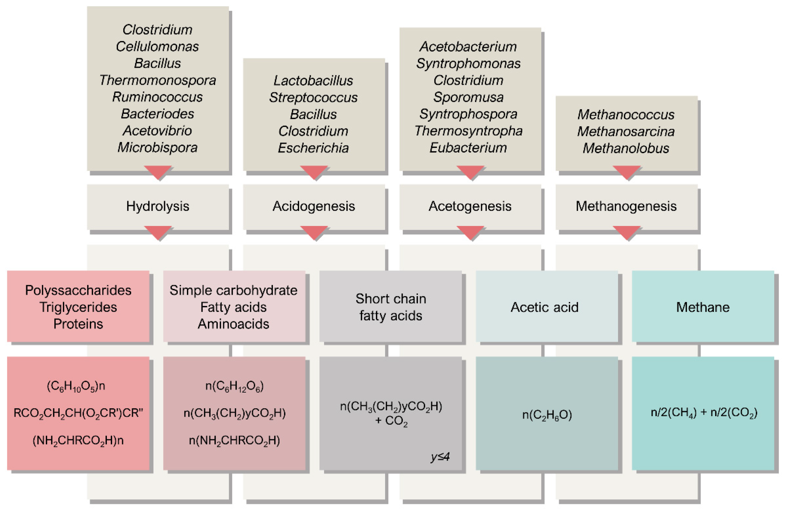
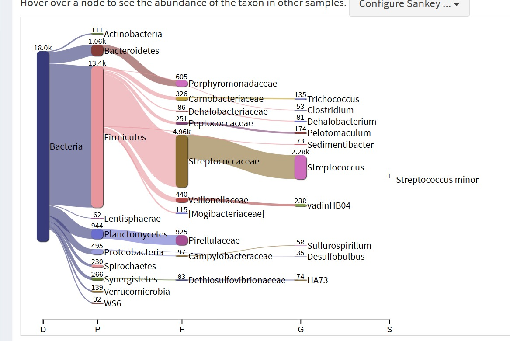
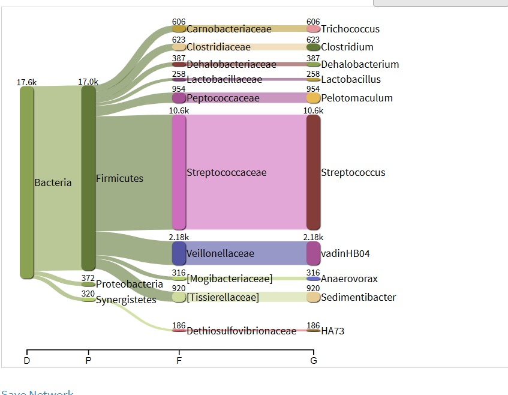
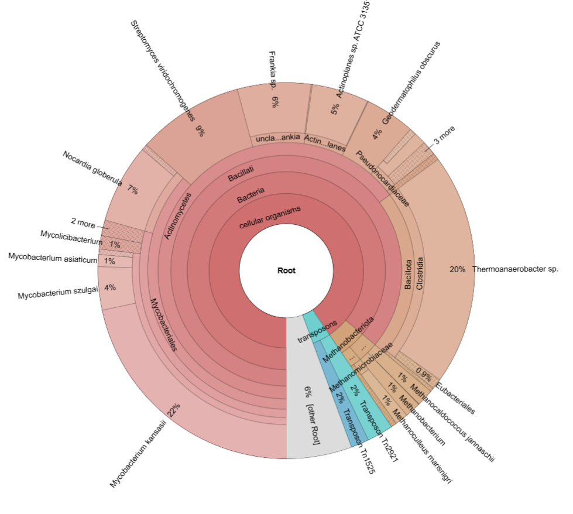
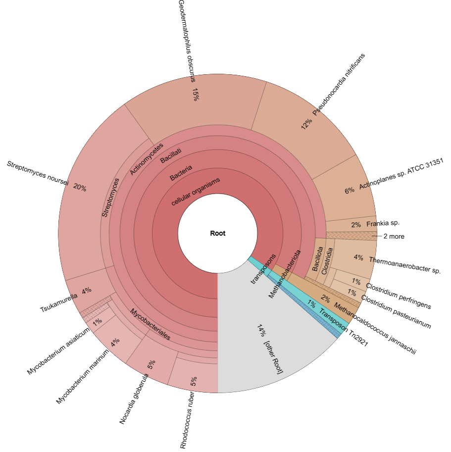

 
# Used tools

The pipeline has been made using SnakeMake version `8.27.1` and python version `3.12.8`.
Below you can find the tools that I worked with myself, for a full overview of all tools used to develop this pipeline, please look at the README.

| Package Name        | Description                                                 | Version   |
|---------------------|-------------------------------------------------------------|-----------|
| [Kraken2](https://github.com/DerrickWood/kraken2)|Taxonomic classification of 16S data |2.1.3|
| [Bracken](https://github.com/jenniferlu717/Bracken)|Re-estimating abundances from Kraken2 output|3.0.1|
| [Krona](https://github.com/marbl/Krona)|Visualising taxonomic classification in a sample|2.8.1|
| [kraken-biom](https://github.com/smdabdoub/kraken-biom)|Converting kraken file to json formatted .biom|1.2.0|
| [FAPROTAX](http://www.loucalab.com/archive/FAPROTAX/lib/php/index.php?section=Home) |Functional analysis for finding (metabolic) pathways that match the founc OTUs|1.2.10|
	

# Introduction

**11-03-2025**

This introduction was written based on an overview of the purification processes and the problems that ACFC faces, provided by Peter Matuku, a professor from the University of Eldoret, who is specialized in water purification.

For this metagenomics project, we will look at a Kenyan factory, owned by [Agro Chemical & Food Company Limited or ACFC](https://acfc.co.ke/), that produces industrial spirits and yeast from sugar molasses (a waste product of sugar production). Specifically, we will take a closer look at microbial communities present in different steps in the water purification process of this factory. 

The production of alcohol and yeast from molasses generates a high volume of wastewater rich in organic matter, nutrients, and recalcitrant compounds (slowly biodegradable or non-biodegradable compounds). The first step in the water purification process is anaerobic digestion, which facilitates organic matter degradation and also produces biogas as a byproduct. The efficiency of anaerobic treatment depends on the dynamics within the microbial community involved in the process. Looking into these dynamics using metagenomics, could offer a way to improve the overall efficiency of the digester.

The following step after anaerobic digestion, is aerobic digestion. The wastewater flows into large, but undeep lagoons where the water is exposed to a lot of oxygen. The wastewater remains in the lagoons for a number of days. After this, the water flows back into the Nyando river.

The main problem is that the effluent from the lagoons does not meet Kenyan standards for water pollution, as certain qualities as the amount of organic matter and nutrients are too high. This causes damage not only to animals and plants in the river but also to people who live downstream, and use this water for bathing, cooking, and drinking.

# Our data

**05-03-2025**

Our data consists of 16S data, which stems from the 16S rRNA component of prokaryotic ribosomes. The data is sequenced using a minION flow cell. The samples are taken from 3 different locations (digester, lagoon influent/lagoon effluent), with 4 replicates, with minor differences being that some samples have added glycerol, to protect the samples in the freezer. And half of the samples have been shaken. The lagoon influent (which is the effluent of the digester), will be called `lagoon in` from now. And the lagoon effluent (which is the river influent), will be called `lagoon out` from now.

|    | Sample Location | Glycerol | Shaken |
|----|-----------------|----------|--------|
| 1  | Lagoon in       | +        | -      |
| 2  | Lagoon in       | +        | +      |
| 3  | Lagoon in       | -        | -      |
| 4  | Lagoon in       | -        | +      |
| 5  | Lagoon out      | +        | -      |
| 6  | Lagoon out      | +        | +      |
| 7  | Lagoon out      | -        | -      |
| 8  | Lagoon out      | -        | +      |
| 9  | Digestor        | +        | -      |
| 10 | Digestor        | +        | +      |
| 11 | Digestor        | -        | -      |
| 12 | Digestor        | -        | +      |

We will merge the data from the samples, depending on the location of origin. So samples 1-4, samples 5-8 and samples 9-12 will be merged, as for our research question it is not important whether glycerol got added or not and whether the sample was shaken or not. Samples 10 and 12 are absent, which means that the quality of these samples was poor and that the barcodes could not be read. However, this will likely not be a problem, as the other two digestor samples remain.


**16-03-2025**

The digestor samples seem to be of very low quality, with in total resulting in 1 read (after trimming, before trimming it had 2 reads). The minion flowcell used for sequencing the data had already been used before and was likely reaching its quotum. The digestor samples got sequenced last and that is most likely the reason for the low quality of the samples. 

1 read is not enough to be able to give an overview of the microorganisms present in the digestor sample, for this reason, we will not be further using the digester samples and we will discuss with the client what other research questions we could have for the lagoon in/out samples. The general research questions remain: what is present in the samples (taxonomic analysis) and what do the present microorganisms do (functional analysis)? So for the pipeline, we will only work with the lagoon in/out samples.


# Research question

**17-03-2025**

For this metagenomics project we have two main research questions, which are:
- What Operational Taxonomic Units (OTUs) are present in the two samples: `lagoon_in` and `lagoon_out`
- What (metabolic) processes take place in the samples of `lagoon_in` and `lagoon_out`

These two main questions are a way to get a first insight into the two samples, after we have constructed a general profile of what OTUs live in the samples and what processes happen in the samples, we would like to compare the two samples to each other:

- What can be said about the difference/similarity of the processes that take place in the samples?
- What can be said about the diversity in OTUs, looking at the alpha diversity?

## Hypothesis

**18-03-2025**

In order to hypothesize about what OTUs are likely present in the two samples and what processes likely take place, I looked for research papers on microbial communities in industrial ethanol production using molasses.

### What OTUs are present?

**18-03-2025**

My first expectation is that both samples (lagoon in/out) will mostly consist of aerobic bacteria, as both sample locations have aerobic conditions with plenty of exposure to oxygen. And that the anaerobic digester mostly contains anaerobic and facultative anaerobic bacteria, however, this cannot be confirmed due to the lack of reads in the digester samples.

In order to research how to optimize ethanol yield in industrial sugarcane ethanol refineries, @De_Oliveira_Lino created a model system to simulate the 'typical' real-world setup. This model system consists of *Lactobacillus amylovorus*, *Lactobacillus fermentum*, *Lactobacillus helveticus*, *Pediococcus claussenii*, *Zymomonas mobilis* and *Saccharomyces cerevisiae*, which is a type of yeast cells that are responsible for ethanol fermentation. These species make up over 80% of the diversity typically found in a real-world setup.

While *Saccharomyces cerevisiae* is essential to the process of producing ethanol, all the bacterial species are seen as 'contaminants', meaning that they do not serve a purpose in the primary process of ethanol production. They will even compete with yeast for available nutrients and the metabolic products of these bacteria can also inhibit yeast cells.

@Iltchenco measured microbial diversity from a factory with comparable wastewater to ACFC (with sugarcane molasses). During the highest methane production, the phyla that dominated here were *bacteroidetes*, *firmicutes* and *proteobacteria*.

Most of the earlier named species are either anaerobic (e.g. *Lactobacillus*), facultative anaerobic (e.g. *Zymomonas mobilis*, *Saccharomyces cerevisiae*) or aerotolerant (e.g. *Pediococcus claussenii*), meaning they do not use oxygen but they are not harmed by oxygen either. All of the species could be present in the anaerobic digester, however this is difficult to confirm due to the lack of data from the digester samples. 

Some of the anaerobic species could still be present in the lagoon influent, but likely not in the lagoon effluent, as the sample will have been exposed to oxygen over a span of multiple days. The facultative anaerobic species and aerotolerant species could however be present in both the lagoon influent and effluent, as they can either use oxygen or are not affected by it.

### What processes take place?

**19-03-2025**

Before the wastewater purification process, fermentation takes place, by *zymomonas mobilis*.

In an anaerobic digester, the available organic carbon from the wastewater gets converted into biogas (60–70% methane + 30–40% carbon dioxide). This process consists of four stages: hydrolysis, acidogenesis, acetogenesis, and methanogenesis. In the image below the involved micro-organisms are shown per process @De_Carvalho.



It is difficult to say what processes likely take place in the aerobic lagoons, as there is not one 'type' of aerobic lagoon. I was not able to find any studies that discuss metagenomics on aerobic lagoons in the treatment process of wastewater from ethanol production. Obvious to state would be that in the lagoons mostly aerobic processes take place, as aerobic lagoons have a large surface area and low depth, allowing maximum exposure to oxygen.

### Diversity between lagoon in/out samples

I expect the lagoon influent to have a higher diversity than the lagoon effluent, as species might still be present from the anaerobic digester. However there is likely a difference in conditions between the digester and the lagoon. Such as a difference in pressure, temperature, humidity and of course the fact that oxygen is not present in the digestor. So any microbial species that leave the digester, might still be present in the digestor effluent (the lagoon in) sample, but might not be present in the lagoon effluent sample anymore, which is after a few days. Because of this I also expect that less (metabolic) take place in the lagoon out sample.


# Metagenomics Pipeline
## Overview of the pipeline
**03-04-2025**

Below you can see the Directed Acyclic Graph (**DAG**) of the pipeline. The pipeline starts with two sample files, for the lagoon influent and effluent. Kraken2 then classifies reads as OTUs, using the Greengenes database. Then Bracken gets run, to re-estimate OTUs on high taxonomic levels, in order to classify these OTUs as deeper levels (with Genus being the max). The output files for Bracken, which are a re-estimated Kraken2 report and a general Bracken output, get used to visualize the taxonomic diversity and calculate the alpha diversity. Bracken output is also used for functional analysis with FAPROTAX, where abundance of metabolic pathways gets determined based on abundance of OTUs. 

After the DAG was generated, we still made some final changes to the pipeline that are worth discussing. We decided not to use bracken, as it seemed to make our found OTUs *less* specific, meaning it was classifying species at a higher taxonomic level and it was also merging a lot of OTUs, removing smaller distinct groups. So Bracken did not seem to be suited for what we wanted to accomplish, which was to provide an accurate overview of the taxonomic diversity in the samples. Sadly, without Bracken, the alpha diversity also could not be determined, as the script we used for alpha diversity, only takes Bracken files as input. We decided to only determine the beta diversity instead, as this does work with Kraken2 output. We also decided to leave out the Sankey chart, as the result we got from Pavian looked a lot better and a lot more readable/suitable to put on a poster or use for the paper.


**03-03-2025**

Before my group can get started on designing the pipeline for our specific case, I would like to look into what steps metagenomics consists of and what kind of tools get used. 

Steps:

- Quality control
- Trimming (if needed)
- Classification (determining what OTUs are present)
- Functional analysis (determining what processes take place in the samples)
- Calculating alpha/beta diversity
- Visualization

Floris will be looking into the quality control and trimming steps. Quality control had already been performed for us, but our teacher recommended we repeat this step, as it is always good to double-check the data from a dataset that gets handed to you.

Jarno will look into how we can calculate the alpha/beta diversity which gives an idea of the diversity of OTUs in the two samples.

I will be looking into the classification and functional analysis steps. For this, I will be using Kraken2 and FAPROTAX. And together we will look into a way to visualize our results, for which I will look into Krona.

Finding a tool for functional analysis that can actually work with Kraken2 output was pretty hard. Most functional analysis tools work with outputs from other classification tools such as QIIME2 and Humann. However, I found that some people on forums mentioned that it is possible to convert Kraken2 output to biom format and then plug it into a tool called FAPROTAX, for functional analysis. 


## Base Calling

**03-03-2025**

This step needs to be done when nanopore sequencing has been used (such as with MinION). This form of sequencing results in a '*squiggle*', which is a long electrical signal that has peaks and dips signifying what kind of molecule passed through the nanopore at that moment. The passing of a molecule through the pore disrupts the ionic current flowing across it and adds a characteristical electrical signal to the 'squiggle'. 

However, before you can move on to the following steps in the metagenomics process, you first have to convert this electrical signal to a DNA or RNA sequence. This is normally done using **Dorado**, which is the default basecaller that is integrated within MinKNOW (the software used to control sequencing devices such as MinION) @OxfordNanopore_Basecalling.

Dorado works optimally with the POD5 file format. Our data consists of fast5 files, so we will have to convert these first.

**04-03-2025**

Our teacher mentioned that base calling had already been performed on the data and that we were not expected to re-do this, so instead we moved onto quality control, using the present .fastq files instead of the FAST5 files.


## Classification
### Kraken 2

**04-03-2025**

Installing Kraken2:

```
conda install bioconda::kraken2
```

**Kraken2** is a tool used for taxonomic classification in metagenomics and was released in 2018 as a more efficient version of Kraken 1 (using less RAM). The tool uses a special kraken classification algorithm with k-mer-based classification. This tool is useful for our research, as it can be used to analyze 16S data, and it seems to be the most efficient and reliable tool available for classification. Another commonly used classification tool is **QIIME 2**, however according to @Salzberg Kraken2 is up to 300 times faster, uses 100x less RAM, and generates more accurate results for 16S rRNA classification than QIIME 2.

A minor drawback of Kraken 2 is that it has a small false-positive rate (<1%) where it wrongly assigns a read to a species. Another classification tool, **KrakenUniq**, does not have this false-positive rate @Different_classification_tools. However, as Kraken 2 still remains much more efficient we decided to use this tool, as we do not think the small false-positive rate will have a large effect on the outcome.

Kraken assigns taxonomic labels to DNA sequences by examining the k-mers within a query sequence and then query a database. k-mers are substrings within the DNA sequence of length *k*. After quering the database, the k-mers get mapped to the `lowest common ancestor` (LCA) of all genomes that contain the given k-mer @Kraken2.

The user also can choose the value k that determines the length of the sequences that Kraken uses for its index; every sequence (or k-mer) of length k is associated with the species in which it occurs. K-mers that occur in two or more species are associated with the lowest common ancestor of those species. The database files contain the taxonomy and k-mer information for the specified database. Following the generation of these files, Bracken requires users to generate a k-mer distribution file. Kraken and Bracken additionally allow the use of multiple threads to accelerate database construction. 

Kraken2 cannot take more than one file as input, so we will merge all .FASTQ files that belong to the same sample locations. This can be done using:

```
cat FAX*.fastq.gz > sample_1.fastq.gz
```

**06-03-2025**

Kraken2 offers support for 3 public 16S databases @Kraken2:

- Greengenes
- RDP
- SILVA

From these 3 databases, only Greengenes contains all available 16S data, whereas RDP and SILVA use smaller subsets of the data (e.g. containing only bacterial or archaeal 16S data). However, RDP and SILVA seem to have deeper taxonomic levels whereas greengenes is more broad (see table). In #Comparing databases I have compared all databases, to see which one classifies the highest amounts of reads, which turned out to be:

We have decided to continue with Greengenes, as we want to make a complete overview of the microbiome in the different steps of the water purification process, so it would make more sense to use a complete database for this and not a subset. We will however test all databases, to make sure that Greengenes is the most thorough database to use in this situation. Possibly RDP or SILVA might be able to classify on a deeper taxonomy level than Greengenes. 

There are also NCBI databases, which include whole genome data of organisms other than micro-organisms (e.g. Eukaryota). I have tried to use the largest NCBI database (`core_nt`) and it was able to classify roots outside of the micro-biological roots, however, the general results were much less thorough than when using Greengenes or any other 16S database. I imagine this is because `core_nt` is not specialized for the classification of 16S data.

Kraken 2 needs the database to have 3 files present, which are

- `taxo.k2d`
- `opts.k2d`
- `hash.k2d`

Normally, one would have to "build" the database using specific Kraken2 commands, however, all 16S databases are already present on the server.

In order to use Kraken2 with one of the databases, the database has to be defined with the `--db` flag, followed by the location of the database.

Later we will use Bracken to improve the quality of the Kraken2 output, however, Bracken only takes Kraken2 report files and not the direct output. So we will have to specify the `--report` flag, followed by an output location/name.

Two other flags have to be specified, which are `--gzip-compressed` and `--fastq-input`, to let the tool know how the input file is formatted (file.fastq.gz)

```
kraken2 --db path/to/database path/to/input.fastq.gz --gzip-compressed --fastq-input --report path/to/report.txt > path/to/output/sample_1.kraken
```

Kraken outputs two output files:

- `Regular Kraken output`: each classified sequence results in 1 line of output. The standard output contains 5 tab-delimited fields (@Kraken2):
1. "C"/"U": a one letter code indicating that the sequence was either **c**lassified or **u**nclassified.
2. The sequence ID, obtained from the FASTA/FASTQ header.
3. The taxonomy ID Kraken 2 used to label the sequence; this is 0 if the sequence is unclassified.
4. The length of the sequence in bp. In the case of paired read data, this will be a string containing the lengths of the two sequences in bp, separated by a pipe character, e.g. "98|94".
5. A space-delimited list indicating the LCA mapping of each k-mer in the sequence(s). For example, "562:13 561:4 A:31 0:1 562:3" would indicate that: the first 13 k-mers mapped to taxonomy ID #562 the next 4 k-mers mapped to taxonomy ID #561 the next 31 k-mers contained an ambiguous nucleotide the next k-mer was not in the database the last 3 k-mers mapped to taxonomy ID #562


- `Kraken report`
1. Percentage of fragments covered by the clade rooted at this taxon
2. Number of fragments covered by the clade rooted at this taxon
3. Number of fragments assigned directly to this taxon
4. A rank code, indicating (U)nclassified, (R)oot, (D)omain, (K)ingdom, (P)hylum, (C)lass, (O)rder, (F)amily, (G)enus, or (S)pecies. 
5. NCBI taxonomic ID number
6. Indented scientific name

The standard Kraken2 output is not used for any tools we used in the pipeline, instead the Kraken2 report is used. The report contains important information such as certain ratios of which fragments got covered in one clade and also the rank code and NCBI taxonomic ID.

### Bracken (Bayesian Re-estimation of Abundance with KrakEN)

**11-03-2025**

```
conda install bioconda::bracken
```

Using Bracken after Kraken2 can improve the Kraken2 output. Kraken2 output is often at the highest taxonomic level, using Bracken this can be corrected a deeper taxonomic level. A preferred level in metagenomics is either genus or species (G/S). Bracken uses a statistical method that computes to which e.g. species labels a read should be assigned, based on the number of other reads found within all other species. Combining Kraken2 and Bracken gives a more accurate output on a deeper level taxonomy @Schmeier.

In total 4 arguments have to be given to use Bracken in this scenario:

* `-d`: path to the database
* `-i`: path to the input, which has to be the report output obtained with Kraken2
* `-o`: user-chosen path for where the output will be saved
* `-l`: allows user to choose the taxonomy level that the reads will be assigned as, e.g. S is species and G is genus

For -l we will use genus (`G`), as you will get an error if the chosen rank is lower than the reported taxa from the Kraken 2 output. The lowest possible taxa is Species (`S`), however these are not reported in the Kraken 2 output, while genus are. The error being (https://github.com/jenniferlu717/Bracken/issues/117):

```
Error: no reads found. Please check your Kraken report
```

Bracken can be run using the code below:
```
bracken -d /path/to/database -i /path/to/input/sample_1.report.txt -o /path/to/output.txt -l G

```

The output shows how many reads are newly assigned and to which species, the report output is not used other than for inspection by the user. Another file automatically gets added in the same directory as the report (`{sample}_bracken_genuses.txt`), containing the original report that is corrected with the output from Bracken. This is the file that we will use further down the pipeline. 


**31-03-2025**

We eventually decided not to use Bracken for the pipeline, as it seemed to make the classification results for kraken less specific and it seemed to remove a lot of the OTUs on deeper taxonomic levels. I already had this feeling, seeing as the functional analysis yielded way less pathways when Bracken had been ran after Kraken2, instead of using direct Kraken2 output. I tried to visualize the difference between a regular Kraken2 report and a Bracken re-estimated Kraken2 report, using a Sankey plot, you can see the results below:

Sankey plot on regular Kraken2 report


Sankey plot on Bracken re-estimated Kraken2 report


**Conclusion**: as you can see, a lot of the thinner "branches" dissapear and the reads for this likely get merged into bigger, more established branches. Because of the way that Bracken works, where classifications get distributed over how "likely" they are to be from specific clades, based off of the earlier number of species classified in them. It is hard to determine whether the outcome of Kraken2 or Bracken is more accurate, however our problem with using Bracken after Kraken2 was that we had almost no output to say anything about. For example the functional analysis after running Bracken told us there are NO metabolic processes taking place in the out lagoon sample, but that is impossible as there will always be processes taking place in microbiomes with a variety of microorganisms present. Thus we have decided to continue without using Bracken.


## Functional analysis

**21-03-2025**

Now that we have gotten a general idea of what kind of micro organisms are present in the lagoon influent and effluent, we can take a closer look at what kind of processes these organisms indulge in. We can do this by doing a pathway analysis of all involved Operational Taxonomic Units (OTUs), this can refer to any classification such as a species, genus or class. But in this case we are only looking at species, as Bracken has been used to further classify any Kraken2 classifications to species level.

We can use the output of Kraken2 in a tool called `FAPROTAX`, this is a database that maps prokaryotic OTUs against metabolic- and other ecological functions @Louca. Examples include processes such as methanogenesis, fermentation and denitrification. However Kraken2 output can not directly be used, first the output has to be converted to .BIOM format. This can be done using the kraken-biom tool.

### kraken-biom

**21-03-2025**

Using kraken-biom, the output of Kraken2 can be converted to .BIOM format, which is the input needed for FAPROTAX. 

Installing kraken-biom, using bioconda:
```
conda install bioconda::kraken-biom
```

Converting Kraken2 output to .BIOM format:

```
kraken-biom /path/to/input.kraken -o /path/to/output.biom --fmt json

```

Use --fmt json to specify that the biom output should have a json format (V.1.0). I did this, because the example .biom input in the faprotax documentation also uses json formatting. Kraken-biom can also output to a newer .biom format (V.2.x), which is HDF5 (Hierarchical Data Format version 5) format. But I decided to settle for the older .biom format as that seems to work well.


### FAPROTAX (Functional Annotation of Prokaryotic Taxa)

**23-03-2025**

FAPROTAX uses a database of prokaryotic metabolic pathways (FAPROTAX.txt), which is essentially an extensive list describing different pathways, e.g. 'arsenate_detoxification', followed up by names of different prokaryotic species that partake in this pathway and including a reference to a paper which states the former. Below you can see an example of a snippet of this database.

```
arsenate_detoxification		

elements:As; main_element:As; electron_donor:variable; electron_acceptor:As; aerobic:variable;
exclusively_prokaryotic:yes; light_dependent:no

# dissimilatory reduction of arsenate for detoxification
# - - - - - - - - - - - - - - - - - - - - - - - - - - - - - - - - - - - - - - -
*Sinorhizobium*M14*									    # DOI:10.1080/01490450802402836
*Bacillus*SXB*										      # DOI:10.1111/jam.12093
*Pantoea*IMH*	                          # DOI:10.1111/jam.12093
*Microbacterium*hydrocarbonoxydans*			# DOI:10.1111/j.1365-2672.2009.04188.x
*Variovorax*paradoxus*							    # DOI:10.1111/j.1365-2672.2009.04188.x
*Kocuria*erythromyxa*							      # DOI:10.1111/j.1365-2672.2009.04188.x
*Arsenicoccus*bolidensis
```

Faprotax does not have a github repo, so everything has to be downloaded from their website (http://www.loucalab.com/archive/FAPROTAX/lib/php/index.php?section=Download). I downloaded the latest version (V.1.2.10) which is a zipped file that contains the faprotax database (`faprotax.txt`), a README and a python script (`collapse_table`).

I used the following arguments:

`- i`: input file (has to be json formatted .biom, containing info on species + abundances)
`- o`: output file, shows all pathways included in the faprotax.txt database, with a corresponding number displaying how active this pathway is in the entire sample (or 'functional group abundances per sample'). See the example below:

```
sulfate_respiration	0.006833712984
sulfur_respiration	0.005150044568
dark_sulfite_oxidation	0
sulfite_respiration	0.004159651382
thiosulfate_respiration	0
respiration_of_sulfur_compounds	0.01198375755
arsenate_detoxification	0

```

`- g` path to the faprotax database (faprotax.txt)
`- n` choose whether the output table should be normalized or not, by normalizing it will convert the number of OTUs to ratios. There are multiple different options:

- `none` (default)
- `columns_before_collapsing`
- `columns_after_collapsing` 
- `columns_before_collapsing_excluding_unassigned`

I chose for columns_after_collapsing, because it gives a good overview of the ratio of metabolic processes in the sample, as it only counts the OTUs with assigned functions and ignores the unassigned OTUs. After using this form of normalization, all active metabolic processes together add up to 1. The higher the number, the more represented the metabolic process is in this sample, so the more OTUs there are that perform this metabolic process.


Before normalizing: 

```
group	in_lagoon_report_bracken_genuses
sulfate_respiration	138
sulfur_respiration	104
```

After normalizing:

```
group	in_lagoon_report_bracken_genuses
sulfate_respiration	0.006833712984
sulfur_respiration	0.005150044568
```

- `--collapse_by_metadata`
Specify what OTU metadata field contains the taxonomic paths in the .biom input. kraken-biom sets this to `taxonomy`.


**Specifiying different types of output**:

`--out_sub_tables_dir`: specifies the directory in which you want to have the output files per detected pathway. Per detected pathway it will provide 1 .biom file, with the name of the pathway. The file is json formatted and contains all OTUs that have been linked to this metabolic pathway.

`--out_groups2records_table`: specify path where you want the table to be saved. Gives a table format of the associations between OTUs and pathways, where 0 stands for no association and 1 stands for association.

`--out_report`:	specify path where you want the report to be saved. The report gives an overview of what OTUs got linked to which pathways. See an example below:

```
# reductive_acetogenesis (1 records):
    1788 (k__Bacteria*p__Firmicutes*c__Clostridia*o__Clostridiales*f__Eubacteriaceae*g__Acetobacterium*s__)


# chemoheterotrophy (3 records):
    1500 (k__Bacteria*p__Bacteroidetes*c__Bacteroidia*o__Bacteroidales*f__Porphyromonadaceae*g__Paludibacter*s__)
    1501 (k__Bacteria*p__Bacteroidetes*c__Bacteroidia*o__Bacteroidales*f__Porphyromonadaceae*g__Parabacteroides*s__)
    1502 (k__Bacteria*p__Bacteroidetes*c__Bacteroidia*o__Bacteroidales*f__Porphyromonadaceae*g__Porphyromonas*s__)
```


I used --force and -v to ensure I could run the pipeline and that the old files would be replaced and to get detailed information on the run as it was happening.

I ran FAPROTAX using the following code:

```
python3 collapse_table.py \
-i /path/to/input.biom \
-o /path/to/output.tsv \
-g FAPROTAX.txt \
-n columns_after_collapsing \
--collapse_by_metadata "taxonomy"\
--out_sub_tables_dir /path/to/output/dir
--out_groups2records_table /path/to/output/table.txt \
--out_report /path/to/output/.txt \ 
--force \
-v \

```

Based on this code I also wrote a SnakeMake rule, which you can find under the SnakeMake chapter in this logbook.


### Minor adjustments faprotax script

**25-03-2025**

faprotax used the python script `collapse_table.py` to assign OTUs to corresponding (metabolic) pathways. However at first when I tried to run this script with the bash command, I would get errors coming from the script, mentioning unescaped escape characters. All I had to do to fix this was to change the `\` in the script to `\\`.


## Visualisation

### Krona

**07-03-2025**

Krona is one of the tools we will use to visualise the data obtained through the other tools. Krona visualises classification data in a multi-layered pie chart. These charts are interactive and can be viewed within a webbrowser @Krona. The visualisation that follows from using this tool could prove as a nice overview of the classification, for in our paper.

Below I describe how to use Krona, using Kraken2 output @AndreaTelatin, @Schmeier:

```
conda install bioconda::krona
```
After installing Krona, an installation message will show that the taxonomy databases need to manually be updated before Krona can generate taxonomic reports. For this, the following script has to be ran:

```
ktUpdateTaxonomy.sh
```

update taxonomy naar conda locatie heel belangrijk!!! en in envs overal python versie zetten yay

ktUpdateTaxonomy.sh /students/2024-2025/Thema07/metagenomics/wastewater/.snakemake/conda/692460f6e8eec96f3093b62149341dd8_/opt/krona/taxonomy
Fetching taxdump.tar.gz...

Krona can be run using the output of Kraken2, the two relevant variables are the counts (-m) and the NCBI taxonomy ID (-t). These variables are found in Kraken2 reports, in column 3 and 5.

In the bash command you have to let Krona know which columns to use, and Krona can be run using:

```
ktImportTaxonomy -t 5 -m 3 {input} -o {output}
```


**16-03-2025**

I have ran all the above described steps and generated Krona plots for all of them, however lagoon in and lagoon out seem to contain large amounts of genetic data that is not identified by Kraken2, with the Greengenes database. 39% of the data of `Lagoon out` is assigned to "other root", and 16% of `Lagoon in`. A potential fix for this, could be to switch to a different, larger database. One that contains more than just 16S data of micro organisms. Although our focus for this research is on micro-organisms, the percentages of genetic data that fall outside of micro-organisms seems relatively large and could be interesting to look further into.

Another issue we have run into is that the data for the digestor does not seem sufficient. Earlier I described how sample 10 and 12 were fully absent from the Minion output, however we expected to be able to work with the remaining data from sample 9 and 11. In total, only 2 species are identified from the two samples, which does not seem representative of the sample area it was taken from. As I expect many (anaerobic) bacteria to be present in the digester (verwijzen naar artikel over metagenomics analyze van zo'n soort digester).


# Snakemake
I have made the Snakemake rules for for kraken-biom, Faprotax and Krona:

## Krona
```
rule all:
    input:

        expand("krona/{sample}_krona.html", sample=config["samples"].keys()),
        expand("logs/krona/{sample}.log", sample=config["samples"].keys()), 
    
rule krona_visualisation:
    input:
        bracken_files="bracken/reports/{sample}.txt"
    output: 
        krona_vis="krona/{sample}_krona.html"
    log:
        "logs/krona/{sample}.log"
    conda:
        "envs/krona.yaml"
    shell:
        """
        ktImportTaxonomy -t 5 \
                         -m 3 \
                         {input} \
                         -o {output} \
                         2> {log}
        """
```

## kraken-biom
```
rule all:
    input:
    
        expand("kraken_biom/{sample}_output.biom", sample=config["samples"].keys()),
        expand("logs/kraken_biom/{sample}.log", sample=config["samples"].keys()),

rule kraken_biom:
    input:  
        bracken_kraken="bracken/reports/{sample}.txt"		
    output: 
        biom_files="kraken_biom/{sample}_output.biom"
    log:
        "logs/kraken_biom/{sample}.log"
    conda:
        "envs/kraken_biom.yaml"
    shell:
        """
        kraken-biom {input} \
                    -o {output} \
                    --fmt json \
                    2> {log}
        """
```

## FAPROTAX
```
rule all:
    input:
    
        expand("faprotax/{sample}/{sample}_function_table.tsv", sample=config["samples"].keys()),
        expand("faprotax/{sample}/{sample}_report.txt", sample=config["samples"].keys()),
        expand("faprotax/{sample}/group_table.txt", sample=config["samples"].keys()),
        expand("faprotax/{sample}/sub_groups/", sample=config["samples"].keys()),
        expand("logs/faprotax/{sample}.log", sample=config["samples"].keys())

rule faprotax:
    input:
        biom_files="kraken_biom/{sample}_output.biom"
    output:
        function_table="faprotax/{sample}/{sample}_function_table.tsv",
        faprotax_report="faprotax/{sample}/{sample}_report.txt",
        sub_table_dir=directory("faprotax/{sample}/sub_groups/"),
        groups_to_records="faprotax/{sample}/group_table.txt"
    log:
        "logs/faprotax/{sample}.log"
    shell:
        """
        python3 tools/FAPROTAX_1.2.10/collapse_table.py \
        -i {input.biom_files} \
        -o {output.function_table} \
        -g tools/FAPROTAX_1.2.10/FAPROTAX.txt \
        -n columns_after_collapsing \
        --collapse_by_metadata "taxonomy" \
        --out_sub_tables_dir {output.sub_table_dir} \
        --out_groups2records_table {output.groups_to_records} \
        --out_report {output.faprotax_report} \
        -v \
        2> {log}
        """
```

## Building envs for the tools

**26-03-2025**

To make it easier for other users to use this pipeline, without them having to download/install all the used tools/packages I will make environments for all tools that are available through bioconda. For this I use the following format, in a `.yaml` file:

```
name: kraken_biom

channels:
  - bioconda
  
dependencies:
  - kraken-biom = 1.2.0
  - python = 3.12.8
```

For the dependencies I enter the used tool, including the version that we have made the pipeline with and I specify the python version the pipeline was made with. At first I had not specified the python version. which resulted in me getting an error where conda was trying to build the kraken-biom environment using an old version of python (2.7), but after specifying the correct version of python this problem was solved.


# Comparing databases
To test which 16S database gives the highest percentage of classified sequences, I will run the kraken2-bracken-krona pipeline for `in_lagoon.fastq.gz` for all 3 databases (Greengenes, RDP, Silva). I decided to test it on this file, because `in_lagoon.fastq.gz` contains the most reads out of the 3 different sample locations for this project. `in_lagoon.fastq.gz` contains a gz compressed fastq file in which samples 1-4 have been merged with cat, because Kraken2 only takes 1 input file. `in_lagoon.fastq.gz` has also been quality checked and trimmed accordingly using fastplong. These 2 pre-processing steps have been performed by Floris and more information about this can be found in his logbook.

First I ran Kraken2 with all 16S databases, the results can be seen in the table below. The percentages are the amount of reads that were classified, the remainder (100%-classified reads) are the amount of unclassified reads. RDP seems to have performed best here and Greengenes worst, however the differences do not seem to be very large. However the goal is to classify as many OTUs on genus level, as this will give better insights into metabolic processes and will help visualising the diversity. Kraken2 only mentions how many reads get classified, but not what level they get classified at.

|            | Lagoon in | Lagoon out |
|------------|-----------|------------|
| RDP        | 99.81%    | 99.77%     |
| Silva      | 99.78%    | 99.68%     |
| Greengenes | 99.71%    | 99.63%     |


However, when generating Krona piecharts with the different Kraken2 reports, made with the 3 different databases, I noticed that the results that RDP and Silva were giving, was not exactly what I expected. Using RDP/Silva as database gave a higher number of 'other root', so assigned reads outside of the microbial clades and they also seemed to not classify as "deep" as Greengenes, with all the taxonomic units being higher than they are with Greengenes. So in the end we still decided to go with Greengenes.

# Krona results
Below you can see the Krona results, using Greengenes as database.

## Lagoon in



**Description lagoon in**: 

The entirety of OTUs in the domain of Bacteria consists of the kingdom Bacillati. One taxonomic level further down, at phylum level, there is a visible divide between actinomycetes and bacillota, with the majority of OTUs consisting of actinomycetes. 

The most common species are Mycobacterium kansasii (22%), Thermoanaerobacter sp (20%) and Streptomyces viridochromogenes (9%). These 3 species make up 51% of the total diversity. 6% is classified as ‘other Root’. 

## Lagoon out


**Description lagoon out**: 

The entirety of the OTUs in the Bacteria domain consists of the kingdom Bacillati. Bacillati divides into Actinomycetes and Bacillota, with mostly actinomycetes. 

The most common species are Streptomyces noursei (20%), Geodermatophilus obscurus (15%) and Pseudonocardia nitrificans (12%). These 3 species make up 47% of the total diversity. 14% is classified as ‘other root’ 


# Conclusion/discussion

In the end, we have determined the (taxonomic) diversity between the microbial communities in the lagoon influent and effluent. And we have determined what (metabolic) processes likely take place in these sample locations, based on the classified OTUs. However, it is difficult to say how accurate the results are, as there was a serious lack of data, with the digester sample missing completely and the lagoon in/out samples not having a high amount of reads. 

I hope that our research can be used as a starting point for future research, where the sequencing can be redone to ensure a higher quality of the reads, as this will lead to more (accurate) classifications and thus a better overview of the actual communities. I think we have looked carefully into the tools we used and evaluated what tools to use and I think this pipeline can give more promising results when used with data of higher quality. The comparison between lagoon in/out was not what our contact person asked for, but it was all we could provide, seeing as the digester samples were absent and seeing as this was the main focus point for the contact person. 


# References


