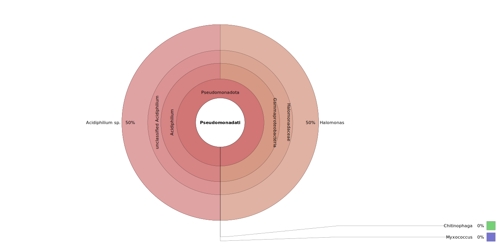
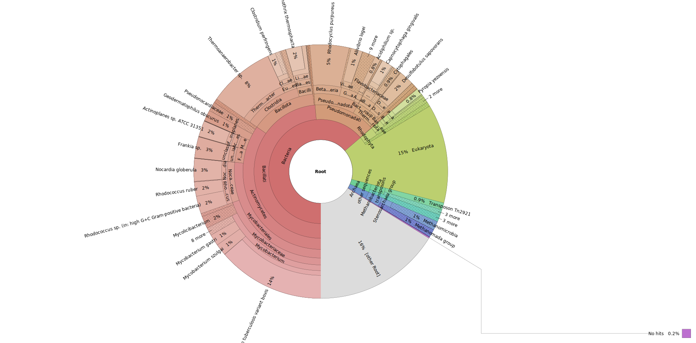
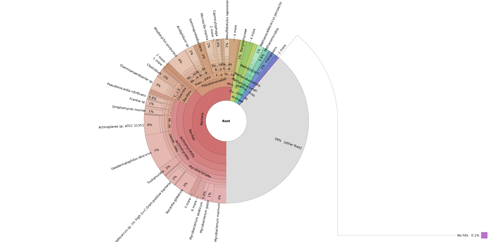

- meer gedachtegang geven/waar ik tegen aanloop
- snakemake erin zetten
- uitleggen hoe ik dingen heb opgelost


# Our data

**05-03-2025**

Minion 16S data, taken from 3 different locations (digestor, lagoon in/lagoon out), with 4 replicates, with minor differences being that some samples have added glycerol, to protect the samples in the freezer. And half of the samples have been shaken.

|    | Sample Location | Glycerol | Shaken |
|----|-----------------|----------|--------|
| 1  | Lagoon in       | +        | -      |
| 2  | Lagoon in       | +        | +      |
| 3  | Lagoon in       | -        | -      |
| 4  | Lagoon in       | -        | +      |
| 5  | Lagoon out      | +        | -      |
| 6  | Lagoon out      | +        | +      |
| 7  | Lagoon out      | -        | -      |
| 8  | Lagoon out      | -        | +      |
| 9  | Digestor        | +        | -      |
| 10 | Digestor        | +        | +      |
| 11 | Digestor        | -        | -      |
| 12 | Digestor        | -        | +      |

We will merge the data from the samples, depending on the location of origin. So sample 1-4, sample 5-8 and sample 9-12 will be merged, as for our research question it is not important whether glycerol got added or not and whether the sample was shaken or not. Sample 10 and 12 are absent, which means that the quality of these samples was poor and that the barcodes could not be read. However this will likely not be a problem, as the other two digestor samples still remain.


# Metagenomics Pipeline

**04-03-2025**

Before my group can get started on designing the pipeline for our specific case, I would like to look into what steps metagenomics consists of and what kind of tools get used. I will not be fully discussing the quality control step, as we are all already familiar with tools such as FastQC and Trimmomatic, from our previous genomics and transcriptomics project.

The two tools I will be looking at are kraken 2 and krona, used for classification and visualisation respectively. Before implementing these tools into our pipeline, I will do some research on the tools.

# Classification
## Kraken 2

**04-03-2025**

```
conda install bioconda::kraken2
```

Kraken 2 is a tool used for taxonomic classification in metagenomics and was released in 2018 as a more efficient version of Kraken 1 (using less RAM). The tool uses a special kraken classification algorithm with k-mer based classification. This tool is useful for our research, as it can be used to analyse 16S data. A con about kraken 2 is that it has a small false-positive rate (<1%) where it wrongly assigns a read to a species. Another classification tool, KrakenUniq, does not have this false-positive rate @Different_classification_tools. However, as kraken 2 still remains much more efficient we decided to use this tool, as we do not think the small false-positive rate will have a large effect on the outcome.

Kraken assigns taxonomic labels to DNA sequences by examining the k-mers within a query sequence and then query a database. k-mers are substrings within the DNA sequence of length *k*. After quering the database, the k-mers get mapped to the lowest common ancestor (LCA) of all genomes that contain the given k-mer @Kraken2.


Kraken2 cannot take more than one file as input, so we will merge all fastq files that belong to the same sample locations. This can be done using:

```
cat FAX*.fastq.gz > sample_1.fastq.gz
```

**06-03-2025**

Kraken2 offers support for 3 public 16S databases @Kraken2:

- Greengenes
- RDP
- SILVA

From these 3 databases, only Greengenes contains all available 16S data, whereas RDP and SILVA use smaller subsets of the data (e.g. containing only bacterial or achaeal 16S data). We have decided to continue with Greengenes, as we want to make a complete overview of the microbiome in the different steps of the water purification process, so it would make more sense to use a complete database for this and not a subset.

The Greengenes database is already available on the server, in order to use Kraken2 with this database, the database has to be defined with the `--db` flag, followed by the location of the database.

Later we will use Bracken to improve the quality of the Kraken2 output, however, Bracken only takes Kraken2 report files and not the direct output. So we will have to specify the `--report` flag, followed by an output location/name.

Two other flags have to be specified, which are `--gzip-compressed` and `--fastq-input`, to let the tool know how the input file is formatted (file.fastq.gz)

```
kraken2 --db path/to/database path/to/input.fastq.gz --gzip-compressed --fastq-input --report path/to/report.txt > path/to/output/sample_1.kraken
```

(show bit of example output from kraken + what it means)
(show bit of example output from report + what it means)


## Bracken (Bayesian Re-estimation of Abundance with KrakEN)

**11-03-2025**

```
conda install bioconda::bracken
```

Using Bracken after Kraken2 can improve the Kraken2 output. Kraken2 output is often at the highest taxonomic level, using Bracken this can be corrected a deeper taxonomic level. A preferred level in metagenomics is either genus or species (G/S). Bracken uses a statistical method that computes to which e.g. species labels a read should be assigned, based on the number of other reads found within all other species. Combining Kraken2 and Bracken gives a more accurate output on a deeper level taxonomy @Schmeier.

In total 4 arguments have to be given to use Bracken in this scenario:

* `-d`: path to the database
* `-i`: path to the input, which has to be the report output obtained with Kraken2
* `-o`: user-chosen path for where the output will be saved
* `-l`: allows user to choose the taxonomy level that the reads will be assigned as, e.g. S is species and G is genus


Bracken can be run using the code below:
```
bracken -d /path/to/database -i /path/to/input/sample_1.report.txt -o /path/to/output.txt -l S

```

The output shows how many reads are newly assigned and to which species, the report output is not used other than for inspection by the user. Following steps will use the normal kraken output, which in this case is `sample_x.kraken`. Bracken has made changes in this file so we can continue working with this file.


# Visualisation

## Krona

**07-03-2025**

Krona is one of the tools we will use to visualise the data obtained through the other tools. Krona visualises classification data in a multi-layered pie chart. These charts are interactive and can be viewed within a webbrowser @Krona. The visualisation that follows from using this tool could prove as a nice overview of the classification, for in our paper.

Below I describe how to use Krona, using Kraken2 output @AndreaTelatin, @Schmeier:

```
conda install bioconda::krona
```
After installing Krona, an installation message will show that the taxonomy databases need to manually be updated before Krona can generate taxonomic reports. For this, the following script has to be ran:

```
ktUpdateTaxonomy.sh
```

Krona can be run using the output of Kraken2, the two relevant variables are the counts (-m) and the NCBI taxonomy ID (-t). These variables are found in the Kraken2 output, in column 2 and 3.

The code below makes a file that consists of only column 2 and 3 from the kraken2 output. Column 2 contains the sequence ID (obtained from the FASTQ header) and column 3 contains the taxonomy ID that Kraken2 has used to label the sequence (equal to the NCBI taxonomy identifier) @Schmeier.

```
cat path/to/sample_1.kraken | cut -f 2,3 > path/to/output.kraken.krona
```

Now the newly made file can be used with Krona, with the following code:

```
ktImportTaxonomy sample_1.kraken.krona
```


or for multiple reports, use *

```
ktImportTaxonomy -t 5 -m 3 -o multi-krona.html *.report 
```

**16-03-2025**

I have ran all the above described steps and generated Krona plots for all of them, however lagoon in and lagoon out seem to contain large amounts of genetic data that is not identified by Kraken2, with the Greengenes database. 39% of the data of `Lagoon out` is assigned to "other root", and 16% of `Lagoon in`. A potential fix for this, could be to switch to a different, larger database. One that contains more than just 16S data of micro organisms. Although our focus for this research is on micro-organisms, the percentages of genetic data that fall outside of micro-organisms seems relatively large and could be interesting to look further into.

Another issue we have run into is that the data for the digestor does not seem sufficient. Earlier I described how sample 10 and 12 were fully absent from the Minion output, however we expected to be able to work with the remaining data from sample 9 and 11. In total, only 2 species are identified from the two samples, which does not seem representative of the sample area it was taken from. As I expect many (anaerobic) bacteria to be present in the digester (verwijzen naar artikel over metagenomics analyze van zo'n soort digester).

## Krona results
### Digestor



### Lagoon in



### Lagoon out




## Base Calling

**03-03-2025**

This step needs to be done when nanopore sequencing has been used (such as with MinION). This form of sequencing results in a 'squiggle', this is a long electrical signal that has peaks and dips signifying what kind of molecule passed through the nanopore at that moment. The passing of a molecule through the pore disrupts the ionic current flowing across it and adds a characteristical electrical signal to the 'squiggle'. 

However, before you can move on to following steps in the metagenomics process, you first have to convert this electrical signal to a DNA or RNA sequence. This is normally done using **Dorado**, this is the default basecaller that is integrated within MinKNOW (the software used to control sequencing devices such as MinION) @OxfordNanopore_Basecalling.

Dorado works optimally with the POD5 file-format. Our data consists of fast5 files, so we will have to convert these first.

https://github.com/nanoporetech/pod5-file-format

### Fast5 to POD5

pip install pod5

Dorado can be installed on Linux using:
```{python}
curl "https://cdn.oxfordnanoportal.com/software/analysis/dorado-0.9.1-linux-x64.tar.gz" -o dorado-0.9.1-linux-x64.tar.gz
tar -xzf dorado-0.9.1-linux-x64.tar.gz
dorado-0.9.1-linux-x64/bin/dorado --version
```

